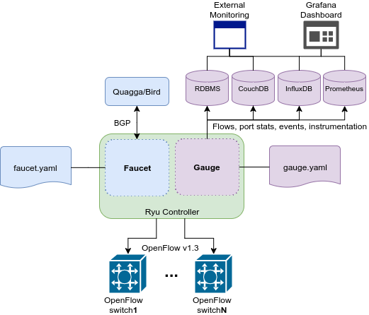

:version: 1.4.0

.. meta::
   :keywords: OpenFlow, Ryu, Faucet, VLAN, SDN

======
Faucet
======

Faucet is an OpenFlow controller for a layer 2 switch based on Waikato University's `Valve <https://github.com/wandsdn/valve>`_. It handles MAC learning and supports VLANs and ACLs.  It is developed as an application for the `Ryu OpenFlow Controller <http://osrg.github.io/ryu/>`_
.

It supports:

- OpenFlow v1.3
- Multiple datapaths (using a single process)
- Mixed tagged/untagged ports
- Port statistics
- ACL support: Rules are added in the order specified. The rule language supports anything the Ryu OpenFlow protocol parser supports (q.v. ofctl to_match()).
- Control unicast flooding by port and by VLAN
- BGP advertisement of controller IPs and static routes and Quagga support
- Policy based forwarding to offload processing to external systems (Eg 802.1x via hostapd)
- Support for IPv4 and IPv6 static routes on both tagged and untagged VLANs
- Integrated support for stats via InfluxDB/Grafana and flows via CouchDB/CouchApp
- Comprehensive Test suite - tests for all features that can be run against mininet (development) and on hardware; Most tests run in parallel to reduce time.
- Code: Python based, easy readability (PEP8 style), documented, Unit tests for all features
- Installation: `Python pip <#installation-with-pip>`_, `pre-built VM available <https://susestudio.com/a/ENQFFD/ryu-faucet>`_, `Docker containers <#installation-with-docker>`_

===============
Feature Details
===============

ACL Support
-----------
Rules are added in the order specified. The rule language supports anything the Ryu OpenFlow protocol parser supports (q.v. ofctl to_match()).
In this example,configure an ACL on port 1, default deny, that passes an IPv4 subnet and ARP.
Following config applies an input ACL to port 1.

Supports any ACL rule that `ofctl_v1_3.py <https://github.com/osrg/ryu/blob/master/ryu/lib/ofctl_v1_3.py>`_ to_match() supports.

.. code:: yaml

  ---
  version: 2

  dps:
      test-switch-1:
          dp_id: 0x000000000001
          interfaces:
              1:
                  native_vlan: 2040
                  acl_in: 1

  vlans:
      2040:
          name: "dev VLAN"

  acls:
      1:
          - rule:
              nw_dst: "172.0.0.0/8"
              dl_type: 0x800
              actions:
                  allow: 1

          - rule:
              dl_type: 0x0806
              actions:
                  allow: 1

          - rule:
              nw_dst: "10.0.0.0/16"
              dl_type: 0x800
              actions:
                  allow: 0

Unicast Flood
-------------
The default is to flood unknown unicast packets (of course). You might not want unicast flooding on a port for security reasons.

If you add unicast_flood: False to a port, then that port will never get unknown destinations flooded to it. So hosts on that port will have to say something to get learned (or someone will need to ND/ARP for it). Broadcasts and Ethernet multicasts are still flooded to that port (so of course ND and ARP work just fine).

You can also add unicast_flood: False to a VLAN, which will override all the ports. On my untrusted VLAN, the default gateway has permanent_learn enabled, and unicast flooding disabled.

=============
Configuration
=============

Faucet is configured with a YAML-based configuration file. A sample configuration file is supplied in ``faucet.yaml``.

The datapath ID may be specified as an integer or hex string (beginning with 0x).

A port not explicitly defined in the YAML configuration file will be set down and will drop all packets.

Versions
--------

The Faucet configuration file format occasionally changes to add functionality or accommodate changes inside Faucet. If the ``version`` field must be specified ``faucet.yaml``, with value ``2``.

Version 2 of the Faucet configuration file format allows multiple datapaths (switches) to be defined in one configuration file using the ``dps`` object, with each datapath sharing the ``vlans`` and ``acls`` objects defined in that file.

.. code:: yaml

  ---
  version: 2

  dps:
      test-switch-1:
          dp_id: 0x000000000001
          interfaces:
              1:
                  native_vlan: 2040
                  acl_in: 1
      test_switch_2:
          dp_id: 0x000000000002
          interfaces:
              1:
                  native_vlan: 2040
                  acl_in: 1

  vlans:
      2040:
          name: "dev VLAN"

  acls:
      1:
          - rule:
              nw_dst: "172.0.0.0/8"
              dl_type: 0x800
              actions:
                  allow: 1

          - rule:
              dl_type: 0x0806
              actions:
                  allow: 1

          - rule:
              nw_dst: "10.0.0.0/16"
              dl_type: 0x800
              actions:
                  allow: 0

Extra DP, VLAN or ACL data can also be separated into different files and included into the main configuration file, as shown below. The ``include`` field is used for configuration files which are required to be loaded, and Faucet will log an error if there was a problem while loading a file. Files listed on ``include-optional`` will simply be skipped and a warning will be logged instead.

Files are parsed in order, and both absolute and relative (to the configuration file) paths are allowed. DPs, VLANs or ACLs defined in subsequent files overwrite previously defined ones with the same name.

faucet.yaml:

.. code:: yaml

  ---
  version: 2

  include:
      - /etc/ryu/faucet/dps.yaml
      - /etc/ryu/faucet/vlans.yaml

  include-optional:
      - acls.yaml

dps.yaml:

.. code:: yaml

  ---
  # Recursive include is allowed, if needed.
  # Again, relative paths are relative to this configuration file.
  include-optional:
      - override.yaml

  dps:
      test-switch-1:
          ...
      test-switch-2:
          ...

=====================
Installation with pip
=====================

Installation automatically installs dependent Python packages [ryu, pyaml, influxdb client] recursively. You may have to install some Python support packages as well.

You have run this as ``root`` or use ``sudo``

.. code:: bash

  apt-get install python-dev # Required for Ubuntu
  pip install faucet
  pip show -f faucet

Optional Install for Network Monitoring Dashboard
-------------------------------------------------
- `Install instructions for InfluxDB <https://docs.influxdata.com/influxdb/v1.1/introduction/getting_started/>`_
- `Install instructions for Grafana <http://docs.grafana.org/installation/>`_

Uninstall
---------
To Uninstall the package

.. code:: bash

  pip uninstall faucet

========================
Installation with docker
========================

We provide official automated builds on `Docker Hub <https://hub.docker.com/r/faucet/>`_ so that you can easily run Faucet and it's components in a self-contained environment without installing on the main host system.

Provided are two Docker containers, one for running Faucet and one for running Gauge. The Gauge container needs to be linked to a database container as well as a Grafana container. We also supply a ``docker-compose.yaml`` that can be used to start all the components together.

Docker tags are used to differentiate versions of Faucet, ``latest`` will always point to ``master`` branch on github and stable versions are also tagged e.g ``v1_3``.

Running Faucet and Gauge with docker-compose
----------------------------------------

1. Follow the `Docker Installation Guide <https://docs.docker.com/engine/installation/>`_ and install `Docker Compose <https://docs.docker.com/compose/install/>`_.

2. Tweak environment variables, exposed ports, volumes and tags in ``docker-compose.yaml`` to match your environment.

3. Run ``docker-compose up`` which will pull all the correct images and start them.

For more advanced documentation on running Faucet with docker please read ``README.docker.md``.

============
Architecture
============

Faucet Deployment around the World
----------------------------------
   https://www.google.com/maps/d/u/0/viewer?mid=1MZ0M9ZtZOp2yHWS0S-BQH0d3e4s&hl=en

.. raw:: html

  

  <iframe src="https://www.google.com/maps/d/u/0/embed?mid=1MZ0M9ZtZOp2yHWS0S-BQH0d3e4s" width="640" height="480"></iframe>
  

.. Comment- TBD Code not working - embed:: https://www.google.com/maps/d/u/0/viewer?mid=1MZ0M9ZtZOp2yHWS0S-BQH0d3e4s&hl=en

=================
OpenFlow Pipeline
=================
As of Faucet v1.3 release, ACL table is now Table 0 so that actions like port mirroring happen without packet modifications and processing.  VLAN table is now Table 1.

::

    PACKETS IN                  +---------------------------+
      +                         |                           |
      |                         |                           |        CONTROLLER
      |                         |                           |             ^
      |                         |                           v       +-----+----+
      |     +----------+  +-----+----+  +----------+  +-----+----+  |4:IPv4_FIB|  +----------+  +----------+
      |     |0:PORT_ACL|  |1:VLAN    |  |2:VLAN_ACL|  |3:ETH_SRC +->+          +->+6:ETH_DST |  |7:FLOOD   |
      +---->+          |  |          |  |          |  |          |  |          |  |          |  |          |
            |          |  |          |  |          |  |          |  +----------+  |          |  |          |
            |          |  |          |  |          |  |          |                |          |  |          |
            |          +->+          +->+          +->+          +--------------->+          +->+          |
            |          |  |          |  |          |  |          |                |          |  |          |
            |          |  |          |  |          |  |          |  +----------+  |          |  |          |
            |          |  |          |  |          |  |          |  |5:IPv6_FIB|  |          |  |          |
            |          |  |          |  |          |  |          +->+          +->+          |  |          |
            +----------+  +----------+  +----------+  +-----+----+  |          |  +------+---+  +--+-------+
                                                            |       +-----+----+         |         |
                                                            v             v              v         v
                                                       CONTROLLER    CONTROLLER          PACKETS OUT

=======
Running
=======

Note: On your system, depending on how Python is installed, you may have to install some additional packages to run faucet.

Run with ``ryu-manager`` (uses ``/etc/ryu/faucet/faucet.yaml`` as configuration by default):

.. code:: bash

    # export FAUCET_CONFIG=/etc/ryu/faucet/faucet.yaml
    # export GAUGE_CONFIG=/etc/ryu/faucet/gauge.yaml
    # export FAUCET_LOG=/var/log/faucet/faucet.log
    # export FAUCET_EXCEPTION_LOG=/var/log/faucet/faucet_exception.log
    # export GAUGE_LOG=/var/log/faucet/gauge_exception.log
    # export GAUGE_EXCEPTION_LOG=/var/log/faucet/gauge_exception.log
    # export GAUGE_DB_CONFIG=/etc/ryu/faucet/gauge_db.yaml
    # $EDITOR /etc/ryu/faucet/faucet.yaml
    # ryu-manager --verbose faucet.faucet

To specify a different configuration file set the ``FAUCET_CONFIG`` environment variable.

Faucet will log to ``/var/log/faucet/faucet.log`` and ``/var/log/faucet/faucet_exception.log`` by default, this can be changed with the ``FAUCET_LOG`` and ``FAUCET_EXCEPTION_LOG`` environment variables.

Gauge will log to ``/var/log/faucet/gauge.log`` and ``/var/log/faucet/gauge_exception.log`` by default, this can be changed with the ``GAUGE_LOG`` and ``GAUGE_EXCEPTION_LOG`` environment variables.

If running Faucet in ``virtualenv`` and without specifying the environment variables above, the default log and configuration locations will change to reflect the virtual environment's prefix path. For example, the default Faucet log location will be ``<venv prefix>/var/log/faucet/faucet.log``. The Gauge configuration must still be updated in this case by modifying ``<venv prefix>/etc/ryu/faucet/gauge.yaml`` to reflect the location of the configuration file used by Faucet (``<venv prefix>/etc/ryu/faucet/faucet.conf``). When using ``virtualenv``, also create the log directory at its new location, ``<venv prefix>/var/log/ryu/faucet``, rather than the global ``/var/log/ryu/faucet``.

To tell Faucet to reload its configuration file after you've changed it, simply send it a ``SIGHUP``:

.. code:: bash

  pkill -SIGHUP -f "ryu-manager faucet.faucet"

=======
Testing
=======

Before issuing a Pull Request
-----------------------------
Run the tests to make sure everything works!
Mininet test actually spins up virtual hosts and a switch, and a test FAUCET controller, and checks connectivity between all the hosts given a test config.  If you send a patch, this mininet test must pass.

.. code:: bash

  git clone https://github.com/REANNZ/faucet
  cd faucet/tests
  # (As namespace, etc needs to be setup, run the next command as root)
  sudo ./faucet_mininet_test.py
  ./test_config.py

Working with Real Hardware
--------------------------

If you are a hardware vendor wanting to support FAUCET, you need to support all the matches in `faucet/valve.py <faucet/valve.py>`_ valve_in_match().

Faucet has been tested against the following switches:
(Hint: look at `faucet/dp.py <faucet/dp.py>`_ to add your switch)

1. `Open vSwitch v2.1+ <http://www.openvswitch.org>`_
2. `Lagopus Openflow Switch <https://lagopus.github.io>`_
3. Allied Telesis `x510 <https://www.alliedtelesis.com/products/x510-series>`_ and `x930 <https://www.alliedtelesis.com/products/x930-series>`_ series
4. `NoviFlow 1248 <http://noviflow.com/products/noviswitch>`_
5. Northbound Networks - `Zodiac FX <http://northboundnetworks.com/collections/zodiac-fx>`_
6. Hewlett Packard Enterprise - `Aruba 5400R, 3810 and 2930F <http://www.arubanetworks.com/products/networking/switches/>`_
7. Netronome produces PCIe adaptors, with an OVS interface - `Agilio CX 2x10GbE card <https://www.netronome.com/products/agilio-cx/>`_

Detailed guides for getting up and running with Faucet on vendor hardware are provided in the `docs/vendors <docs/vendors>`_ directory.

Faucet's design principle is to be as hardware agnostic as possible and not require Table Type Patterns. This means that Faucet expects the hardware Open Flow Agent (OFA) to hide implementation details, including which tables are best for certain matches or whether there is special support for multicast - Faucet expects the OFA to leverage the right hardware transparently.

=====
Gauge
=====

Gauge is the monitoring application. It polls each port for statistics and periodically dumps the flow table for statistics.

Gauge reads the faucet yaml configuration files of the datapaths it monitors. Which datapaths to monitor is provided in a configuration file containing a list of faucet yaml files, one per line.

The list of faucet yaml config is by default read from ``/etc/ryu/faucet/gauge.yaml``. This can be set with the ``GAUGE_CONFIG`` environment variable. Exceptions are logged to the same file as faucet's exceptions.

Gauge is run with ``ryu-manager``:

.. code:: bash

  $EDITOR /etc/ryu/faucet/gauge.yaml
  ryu-manager faucet.gauge

Screenshots
-----------
.. image:: docs/images/gauge-nznog17.png

=======
Support
=======

We run a number of mailing lists for communication between users and developers of Faucet, as well as a low traffic mailing list for announcements of new versions:

- https://list.waikato.ac.nz/mailman/listinfo/faucet-announce
- https://list.waikato.ac.nz/mailman/listinfo/faucet-dev
- https://lists.geant.org/sympa/info/faucet-users

Additional documentation is available under the `docs <docs>`_ directory.

Faucet blog by Josh Bailey available at http://faucet-sdn.blogspot.co.nz.

To create a issue, use `GitHub Issues <https://github.com/REANNZ/faucet/issues>`_.
