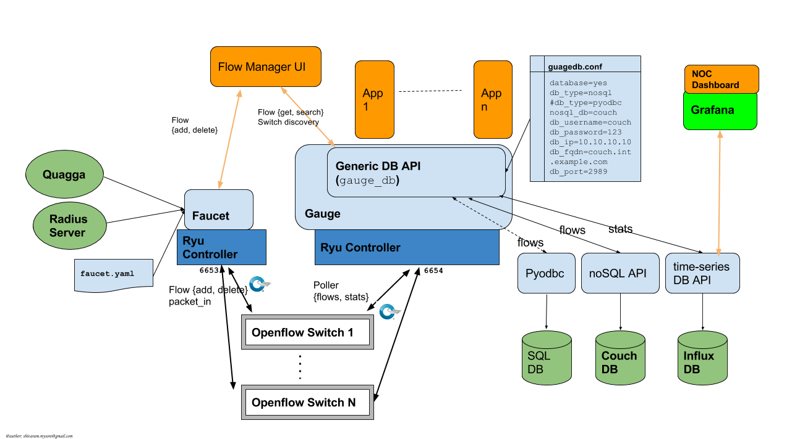
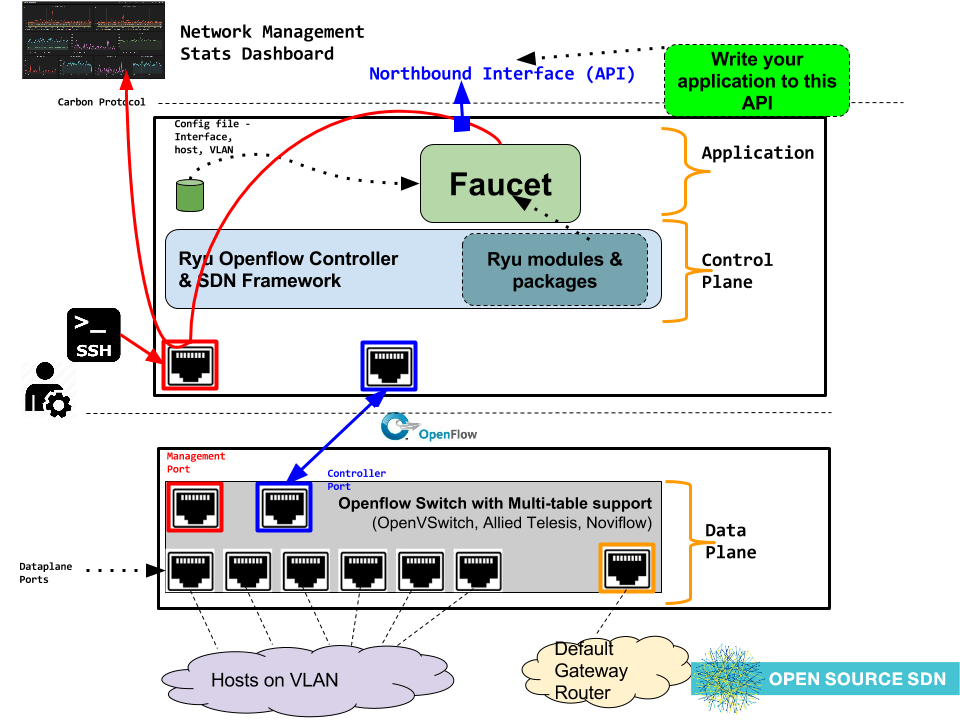
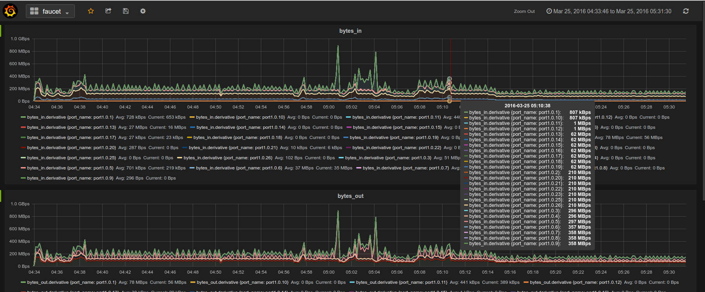

:version: 1.1
:copyright: 2015 `REANNZ <http://www.reannz.co.nz/>`_.  All Rights Reserved.

.. meta::
   :keywords: Openflow, Ryu, Faucet, VLAN, SDN

======
Faucet
======

Faucet is an Openflow controller for a layer 2 switch based on OpenvApour's Valve. It handles MAC learning and supports VLANs and ACLs.  It is developed as an application for the `Ryu Open Flow Controller <http://osrg.github.io/ryu/>`_
.

It supports:

- OpenFlow v1.3
- Multiple datapaths (via multiple processes)
- Mixed tagged/untagged ports
- Port statistics
- ACL support: Rules are added in the order specified. The rule language supports anything the Ryu OpenFlow protocol parser supports (q.v. ofctl to_match()).
- Control unicast flooding by port and by VLAN
- BGP advertisement of controller IPs and static routes and Quagga support
- Policy based forwarding to offload processing to external systems (Eg 802.1x via hostapd)
- Support for IPv4 and IPv6 static routes on both tagged and untagged VLANs
- Integrated support for InfluxDB/Grafana
- Comprehensive Test suite - tests for all features that can be run against mininet (development) and on hardware; Most tests run in parallel to reduce time.
- Code: Python based, easy readability (PEP8 style), documented, Unit tests for all features
- Installation: Python pip (pip install ryu_faucet), pre-built VM available - https://susestudio.com/a/ENQFFD/ryu-faucet, Makefiles to build Docker images

===============
Feature Details
===============

ACL Support
-----------
Rules are added in the order specified. The rule language supports anything the Ryu OpenFlow protocol parser supports (q.v. ofctl to_match()).
In this example,configure an ACL on port 1, default deny, that passes an IPv4 subnet and ARP.
Following config applies an input ACL to port 1.

Supports any ACL rule that https://github.com/osrg/ryu/blob/master/ryu/lib/ofctl_v1_3.py to_match() supports.

.. code:: yaml

  ---
  version: 2

  dps:
      test-switch-1:
          dp_id: 0x000000000001
          interfaces:
              1:
                  native_vlan: 2040
                  acl_in: 1

  vlans:
      2040:
          name: "dev VLAN"

  acls:
      1:
          - rule:
              nw_dst: "172.0.0.0/8"
              dl_type: 0x800
              allow: 1

          - rule:
              dl_type: 0x0806
              allow: 1

          - rule:
              nw_dst: "10.0.0.0/16"
              dl_type: 0x800
              allow: 0

          - rule:

Unicast Flood
-------------
The default is to flood unknown unicast packets (of course). You might not want unicast flooding on a port for security reasons.

If you add unicast_flood: False to a port, then that port will never get unknown destinations flooded to it. So hosts on that port will have to say something to get learned (or someone will need to ND/ARP for it). Broadcasts and Ethernet multicasts are still flooded to that port (so of course ND and ARP work just fine).

You can also add unicast_flood: False to a VLAN, which will override all the ports. On my untrusted VLAN, the default gateway has permanent_learn enabled, and unicast flooding disabled.

=============
Configuration
=============

Faucet is configured with a YAML-based configuration file. A sample configuration file is supplied in ``faucet.yaml``.

The datapath ID may be specified as an integer or hex string (beginning with 0x).

A port not explicitly defined in the YAML configuration file will be set down and will drop all packets.

Versions
--------

The Faucet configuration file format occasionally changes to add functionality or accomodate changes inside Faucet. If the ``version`` field is not specified in ``faucet.yaml``, the current default value is ``1``.

Version 1 of the Faucet configuration file format does not allow multiple datapaths to be defined. The one datapath configured for this Faucet instance is configured using top level values, a sample of which can be found in ``faucet.yaml``. Previous (1.0 and older) versions of Faucet do not support the ``version`` field, so most configuration files in this format should not use it.

This version of the Faucet configuration file format is deprecated and will be removed shortly, so new installations of Faucet should use the version 2 format, documented below.

.. code:: yaml

  ---
  dp_id: 0x000000000001
  name: "test-switch-1"

  interfaces:
      1:
          native_vlan: 2040
          acl_in: 1

  vlans:
      2040:
          name: "dev VLAN"

  acls:
      1:
          - rule:
              nw_dst: "172.0.0.0/8"
              dl_type: 0x800
              allow: 1

          - rule:
              dl_type: 0x0806
              allow: 1

          - rule:
              nw_dst: "10.0.0.0/16"
              dl_type: 0x800
              allow: 0

Version 2 of the Faucet configuration file format adds the ``version`` field, and allows multiple datapaths (switches) to be defined in one configuration file using the ``dps`` object, with each datapath sharing the ``vlans`` and ``acls`` objects defined in that file.

.. code:: yaml

  ---
  version: 2

  dps:
      test-switch-1:
          dp_id: 0x000000000001
          interfaces:
              1:
                  native_vlan: 2040
                  acl_in: 1
      test_switch_2:
          dp_id: 0x000000000002
          interfaces:
              1:
                  native_vlan: 2040
                  acl_in: 1

  vlans:
      2040:
          name: "dev VLAN"

  acls:
      1:
          - rule:
              nw_dst: "172.0.0.0/8"
              dl_type: 0x800
              allow: 1

          - rule:
              dl_type: 0x0806
              allow: 1

          - rule:
              nw_dst: "10.0.0.0/16"
              dl_type: 0x800
              allow: 0

Extra DP, VLAN or ACL data can also be separated into different files and included into the main configuration file, as shown below. The ``include`` field is used for configuration files which are required to be loaded, and Faucet will log an error if there was a problem while loading a file. Files listed on ``include-optional`` will simply be skipped and a warning will be logged instead.

Files are parsed in order, and both absolute and relative (to the configuration file) paths are allowed. DPs, VLANs or ACLs defined in subsequent files overwrite previously defined ones with the same name.

faucet.yaml:

.. code:: yaml

  ---
  version: 2

  include:
      - /etc/ryu/faucet/dps.yaml
      - /etc/ryu/faucet/vlans.yaml

  include-optional:
      - acls.yaml

dps.yaml:

.. code:: yaml

  ---
  # Recursive include is allowed, if needed.
  # Again, relative paths are relative to this configuration file.
  include-optional:
      - override.yaml

  dps:
      test-switch-1:
          ...
      test-switch-2:
          ...

============
Installation
============
Installation automatically installs dependent Python packages [ryu, pyaml, influxdb client] recursively.

You have run this as ``root`` or use ``sudo``
.. code:: bash

  # pip install https://pypi.python.org/packages/a3/5a/197046b6fbad2f129e108358d7ba9674ebae638a227e6a1680cd77c7bd13/ryu-faucet-1.1.tar.gz
  # pip show -f ryu-faucet

Optional Install for Network Monitoring Dashboard
-------------------------------------------------
  - To setup InfluxDB v0.11+ - https://docs.influxdata.com/influxdb/v0.10/introduction/getting_started/
  - To setup Grafana v3.x - http://docs.grafana.org/installation/

Uninstall
---------
To Uninstall the package

``# pip uninstall ryu-faucet``

============
Architecture
============

==========
Deployment
==========

Deployment at Open Networking Foundation
----------------------------------------
.. image:: src/docs/images/ONF_Faucet_deploy1.png

Faucet Deployment around the World
----------------------------------
   https://www.google.com/maps/d/u/0/viewer?mid=1MZ0M9ZtZOp2yHWS0S-BQH0d3e4s&hl=en

.. raw:: html

  

  <iframe src="https://www.google.com/maps/d/u/0/embed?mid=1MZ0M9ZtZOp2yHWS0S-BQH0d3e4s" width="640" height="480"></iframe>
  

.. Comment- TBD Code not working - embed:: https://www.google.com/maps/d/u/0/viewer?mid=1MZ0M9ZtZOp2yHWS0S-BQH0d3e4s&hl=en

=================
OpenFlow Pipeline
=================

::

    PACKETS IN      +-------------------------+ +-------------------------+
      +             |                         | |                         |
      |             |                         | |        CONTROLLER       |
      |             |                         | |            ^            |
      |             |                         | |       +----+-----+      v
      |       +-----+----+  +----------+  +---+-+----+  |3:IPv4_FIB|  +---+------+  +----------+
      |       |0:VLAN    |  |1:ACL     |  |2:ETH_SRC +->+          +->+5:ETH_DST |  |6:FLOOD   |
      +------>+          |  |          |  |          |  |          |  |          |  |          |
              |          |  |          |  |          |  +----------+  |          |  |          |
              |          |  |          |  |          |                |          |  |          |
              |          +->+          +->+          +--------------->+          +->+          |
              |          |  |          |  |          |                |          |  |          |
              |          |  |          |  |          |  +----------+  |          |  |          |
              |          |  |          |  |          |  |4:IPv6_FIB|  |          |  |          |
              |          |  |          |  |          +->+          +->+          |  |          |
              +----------+  +----------+  +----+-----+  |          |  +------+---+  +--+-------+
                                               |        +----+-----+         |         |
                                               v             v               v         v
                                           CONTROLLER    CONTROLLER          PACKETS OUT

=======
Running
=======

Note: On your system, depending on how Python is installed, you may have to install some additional packages to run faucet.

Run with ``ryu-manager`` (uses ``/etc/ryu/faucet/faucet.yaml`` as configuration by default):
::

    # export FAUCET_CONFIG=/etc/ryu/faucet/faucet.yaml
    # export GAUGE_CONFIG=/etc/ryu/faucet/gauge.conf
    # export FAUCET_LOG=/var/log/faucet/faucet.log
    # export FAUCET_EXCEPTION_LOG=/var/log/faucet/faucet_exception.log
    # export GAUGE_LOG=/var/log/faucet/gauge_exception.log
    # export GAUGE_EXCEPTION_LOG=/var/log/faucet/gauge_exception.log
    # $EDITOR /etc/ryu/faucet/faucet.yaml
    # ryu-manager --verbose faucet.py

To find the location of ``faucet.py``, run

``# pip show ryu-faucet`` to get Location path.  Then run:

``# ryu-manager --verbose <Location_Path>/ryu_faucet/org/onfsdn/faucet/faucet.py``

  Alternatively, if OF Controller is using a non-default port of 6633, for example 6653, then:

``# ryu-manager --verbose  --ofp-tcp-listen-port 6653 <Location_Path>/ryu_faucet/org/onfsdn/faucet/faucet.py``

On MacOS X, for example, one would run this as:

``#  ryu-manager --verbose /opt/local/Library/Frameworks/Python.framework/Versions/2.7/lib/python2.7/site-packages/ryu_faucet/org/onfsdn/faucet/faucet.py``

To specify a different configuration file set the ``FAUCET_CONFIG`` environment variable.

Faucet will log to ``/var/log/faucet/faucet.log`` and ``/var/log/faucet/faucet_exception.log`` by default, this can be changed with the ``FAUCET_LOG`` and ``FAUCET_EXCEPTION_LOG`` environment variables.

Gauge will log to ``/var/log/faucet/gauge.log`` and ``/var/log/faucet/gauge_exception.log`` by default, this can be changed with the ``GAUGE_LOG`` and ``GAUGE_EXCEPTION_LOG`` environment variables.

If running Faucet in ``virtualenv`` and without specifying the environment variables above, the default log and configuration locations will change to reflect the virtual environment's prefix path. For example, the default Faucet log location will be ``<venv prefix>/var/log/faucet/faucet.log``. The Gauge configuration must still be updated in this case by modifying ``<venv prefix>/etc/ryu/faucet/gauge.conf`` to reflect the location of the configuration file used by Faucet (``<venv prefix>/etc/ryu/faucet/faucet.conf``). When using ``virtualenv``, also create the log directory at its new location, ``<venv prefix>/var/log/ryu/faucet``, rather than the global ``/var/log/ryu/faucet``.

To tell Faucet to reload its configuration file after you've changed it, simply send it a ``SIGHUP``:

``# pkill -SIGHUP -f "ryu-manager faucet.py"``

=======
Testing
=======

Before issuing a Pull-Request
-----------------------------
Run the tests to make sure everything works!
Mininet test actually spins up virtual hosts and a switch, and a test FAUCET controller, and checks connectivity between all the hosts given a test config.  If you send a patch, this mininet test must pass.::

    # git clone https://github.com/onfsdn/faucet
    # cd faucet/tests
    (As namespace, etc needs to be setup, run the next command as root)
    # sudo ./faucet_mininet_test.py
    # ./test_config.py

Working with Real Hardware
--------------------------

If you are a hardware vendor wanting to support FAUCET, you need to support all the matches in src/ryu_faucet/org/onfsdn/faucet/valve.py:valve_in_match().

Faucet has been tested against the following switches:
(Hint: look at src/ryu_faucet/org/onfsdn/faucet/dp.py to add your switch)

    1. Open vSwitch v2.1+ - Open Source available at http://www.OpenVSwitch.Org
    2. Lagopus Openflow Switch - Open Source available at https://lagopus.github.io/
    3. Allied Telesis x510 and x930 series - https://www.alliedtelesis.com/products/x930-series
    4. NoviFlow 1248 - http://noviflow.com/products/noviswitch/
    5. Northbound Networks - Zodiac FX - http://northboundnetworks.com/collections/zodiac-fx
    6. HP Enterprise Aruba 3810 - http://www.arubanetworks.com/products/networking/switches/3810-series/

Faucet's design principle is to be as hardware agnostic as possible and not require TTPs. That means that Faucet excepts the hardware OFA to hide implementation details, including which tables are best for certain matches or whether there is special support for multicast - Faucet excepts the OFA to leverage the right hardware transparently.

============================================================
Buying and running commerical switches supporting ryu-faucet
============================================================

Allied Telesis
--------------

 `Allied Telesis <http://www.alliedtelesis.com/sdn` sells their products via distributors and resellers. To order in USA call `ProVantage <http://www.provantage.com/allied-telesis-splx10~7ALL912L.htm>`.  To find a sales office near you, visit `Allied Telesis <http://www.AlliedTelesis.com>`

* On Allied Telesis all vlans must be included in the vlan database config on the switch before they can be used by Openflow.

NoviFlow
--------
`NoviFlow <http://noviflow.com/>`

NorthBound Networks
-------------------
`NorthBound Networks <http://northboundnetworks.com/>`

FAUCET supports the Zodiac FX as of v0.60 firmware.

HP Enterprise
-------------
`HP Enterprise <http://www.hp.com>` and its many distributors and resellers.

=====
Gauge
=====

Gauge is the monitoring application. It polls each port for statistics and periodically dumps the flow table for statistics.

Gauge reads the faucet yaml configuration files of the datapaths it monitors. Which datapaths to monitor is provided in a configuration file containing a list of faucet yaml files, one per line.

The list of faucet yaml config is by default read from ``/etc/ryu/faucet/gauge.conf``. This can be set with the ``GAUGE_CONFIG`` environment variable. Exceptions are logged to the same file as faucet's exceptions.

Gauge is run with ``ryu-manager``:

``$ $EDITOR /etc/ryu/faucet/gauge.conf``

``$ ryu-manager gauge.py``

Screenshots
-----------
.. image:: src/docs/images/faucet-snapshot1.png

.. image:: src/docs/images/faucet-snapshot3.png

=======
Support
=======

If you have any technical questions, problems or suggestions regarding Faucet please send them to `faucet-dev@OpenflowSDN.Org <mailto:faucet-dev@openflowsdn.org>`.  Mailing list archives are available `here <https://groups.google.com/a/openflowsdn.org/forum/#!forum/faucet-dev>`.

Documentation is available under `docs <https://github.com/onfsdn/faucet/tree/master/src/docs>` directory.

Faucet related blog by Josh Bailey available at http://faucet-sdn.blogspot.co.nz/

To create a issue, use `Github issues <https://github.com/onfsdn/faucet/issues>`
