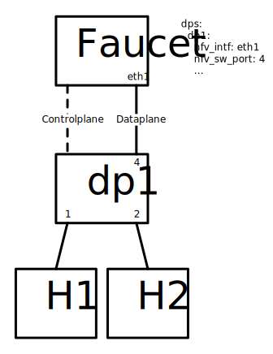

Configuration
=============

.. _faucet-configuration:

Faucet configuration
--------------------

Faucet is configured with a YAML-based configuration file, ``faucet.yaml``.
The following is example demonstrating a few common features:

.. literalinclude:: ../etc/faucet/faucet.yaml
  :language: yaml
  :caption: faucet.yaml
  :name: faucet.yaml

.. literalinclude:: ../etc/faucet/acls.yaml
  :language: yaml
  :caption: acls.yaml
  :name: acls.yaml

The datapath ID may be specified as an integer or hex string (beginning with 0x).

A port not explicitly defined in the YAML configuration file will be left down and will drop all packets.

**Default Port and Configuration**

Faucet uses port 6653 as the default listening port. You can customize this and other settings in the following configuration files:

- `/etc/default/faucet`
- `/etc/default/gauge`
- `/etc/faucet/ryu.conf`

Configuration options
~~~~~~~~~~~~~~~~~~~~~

Top Level
#########

.. list-table:: Faucet.yaml
    :widths: 15 15 10 60
    :header-rows: 1

    * - Attribute
      - Type
      - Default
      - Description
    * - acls
      - dictionary
      - {}
      - Configuration specific to acls. The keys are names of each acl, and the
        values are config dictionaries holding the acl's configuration (see
        below).
    * - dps
      - dictionary
      - {}
      - Configuration specific to datapaths. The keys are names or dp_ids
        of each datapath, and the values are config dictionaries holding the
        datapath's configuration (see below).
    * - meters
      - dictionary
      - {}
      - Configuration specific to meters. The keys are names of each meter,
        and the values are config dictionaries holding the meter's configuration
        (see below).
    * - routers
      - dictionary
      - {}
      - Configuration specific to routers. The keys are names of each router,
        and the values are config dictionaries holding the router's
        configuration (see below).
    * - version
      - integer
      - 2
      - The config version. 2 is the only supported version.
    * - vlans
      - dictionary
      - {}
      - Configuration specific to vlans. The keys are names or vids of each
        vlan, and the values are config dictionaries holding the
        vlan's configuration (see below).

DP
##

DP configuration is entered in the 'dps' configuration block. The 'dps'
configuration contains a dictionary of configuration blocks each
containing the configuration for one datapath. The keys can either be
string names given to the datapath, or the OFP datapath id.

.. list-table:: dps: <dp name or id>: {}
    :widths: 30 15 15 40
    :header-rows: 1

    * - Attribute
      - Type
      - Default
      - Description
    * - advertise_interval
      - integer
      - 30
      - How often to advertise (eg. IPv6 RAs)
    * - arp_neighbor_timeout
      - integer
      - 250
      - ARP and neighbour timeout in seconds
    * - description
      - string
      - name
      - Description of this datapath, strictly informational
    * - dot1x
      - dictionary
      - {}
      - 802.1X configuration (see below)
    * - dp_id
      - integer
      - The configuration key
      - The OFP datapath-id of this datapath
    * - drop_broadcast_source_address
      - boolean
      - True
      - If True, Faucet will drop any packet from a broadcast source address
    * - drop_spoofed_faucet_mac
      - boolean
      - True
      - If True, Faucet will drop any packet it receives with an ethernet
        source address equal to a MAC address that Faucet is using.
    * - group_table
      - boolean
      - False
      - If True, Faucet will use the OpenFlow Group tables to flood packets.
        This is an experimental feature that is not fully supported by all
        devices and may not interoperate with all features of faucet.
    * - hardware
      - string
      - "Open vSwitch"
      - The hardware model of the datapath. Defaults to "Open vSwitch". Other
        options can be seen in the documentation for valve.py
    * - high_priority
      - integer
      - low_priority + 1 (9001)
      - The high priority value.
    * - highest_priority
      - integer
      - high_priority + 98 (9099)
      - The highest priority number to use.
    * - ignore_learn_ins
      - integer
      - 10
      - Ignore every approx nth packet for learning. 2 will ignore 1 out of 2
        packets; 3 will ignore 1 out of 3 packets. This limits control plane
        activity when learning new hosts rapidly. Flooding will still be done
        by the dataplane even with a packet is ignored for learning purposes.
    * - interfaces
      - dictionary
      - {}
      - Configuration block for interface specific config (see below)
    * - interface_ranges
      - dictionary
      - {}
      - Contains the config blocks for sets of multiple interfaces. The
        configuration entered here will be used as the defaults for these
        interfaces.  The defaults can be overwritten by configuring the
        interfaces individually, which will also inherit all defaults not
        specifically configured.
        For example, if the range specifies tagged_vlans: [1, 2, 3], and the
        individual interface specifies tagged_vlans: [4], the result will be
        tagged_vlans: [4]. The format for the configuration key is a comma
        separated string.  The elements can either be the name or number of
        an interface or a range of port numbers eg: "1-6,8,port9".
    * - learn_ban_timeout
      - integer
      - 10
      - When a host is rapidly moving between ports Faucet will stop learning
        mac addresses on one of the ports for this number of seconds.
    * - learn_jitter
      - integer
      - 10
      - In order to reduce load on the controller Faucet will randomly vary the
        timeout for learnt mac addresses by up to this number of seconds.
    * - lldp_beacon
      - dictionary
      - {}
      - Configuration block for LLDP beacons
    * - low_priority
      - integer
      - low_priority + 9000 (9000)
      - The low priority value.
    * - lowest_priority
      - integer
      - priority_offset (0)
      - The lowest priority number to use.
    * - max_host_fib_retry_count
      - integer
      - 10
      - Limit the number of times Faucet will attempt to resolve a next-hop's
        l2 address.
    * - max_hosts_per_resolve_cycle
      - integer
      - 5
      - Limit the number of hosts resolved per cycle.
    * - max_resolve_backoff_time
      - integer
      - 32
      - When resolving next hop l2 addresses, Faucet will back off
        exponentially until it reaches this value.
    * - metrics_rate_limit_sec
      - integer
      - 0
      - Rate limit metric updates - don't update metrics if last update
        was less than this many seconds ago.
    * - name
      - string
      - The configuration key
      - A name to reference the datapath by.
    * - ofchannel_log
      - string
      - None
      - Name of logfile for openflow logs
    * - packetin_pps
      - integer
      - None
      - Ask switch to rate limit packetin in pps.
    * - slowpath_pps
      - integer
      - None
      - Ask switch to rate limit slowpath in pps.
    * - priority_offset
      - integer
      - 0
      - Shift all priority values by this number.
    * - proactive_learn_v4
      - boolean
      - True
      - Whether proactive learning is enabled for IPv4 nexthops
    * - proactive_learn_v6
      - boolean
      - True
      - Whether proactive learning is enabled for IPv6 nexthops
    * - stack
      - dictionary
      - {}
      - Configuration block for stacking config, for loop protection (see
        below)
    * - timeout
      - integer
      - 300
      - Timeout for MAC address learning
    * - use_idle_timeout
      - boolean
      - False
      - Turn on/off the use of idle timeout for src_table, default OFF.
    * - table_sizes
      - dictionary
      - {}
      - For TFM based switches, size of each FAUCET table (any may be specified)
    * - port_table_scale_factor
      - float
      - 1.0
      - For TFM based switches, and for tables that are sized by number of ports, scale size estimate.
    * - global_vlan
      - int
      - 2**11-1
      - When global routing is enabled, FIB VID used internally

Stacking (DP)
#############

Stacking is configured in the dp configuration block and in the interface
configuration block. At the dp level the following attributes can be configured
within the configuration block 'stack':

.. list-table:: dps: <dp name or id>: stack: {}
    :widths: 30 15 15 40
    :header-rows: 1

    * - Attribute
      - Type
      - Default
      - Description
    * - priority
      - integer
      - 0
      - Setting any value for stack priority indicates that this datapath
        should be the root for the stacking topology. When multiple stack DPs
        have a priority value applied, the root will be chosen as the DP with
        the lowest priority
    * - down_time_multiple
      - integer
      - 3
      - The down_time_multiple value determines the number of root update time
        intervals for a stack node to be considered healthy when not running.
    * - min_stack_health
      - float
      - 1.0
      - Minimum percentage value of required UP stack ports for this stack node to
        be considered healthy. The default value of 1.0 is considered 100%.
    * - min_lacp_health
      - float
      - 1.0
      - Minimum percentage value of required UP stack ports for this stack node to
        be considered healthy. The default value of 1.0 is considered 100%.

LLDP (DP)
#########

LLDP beacons are configured in the dp and interface configuration blocks.

LLDP beacons can be used to, among other things, facilitate physical
troubleshooting (e.g. so that a standard cable tester can display port
information), verify FAUCET stacking topology, and cue a phone to use
the right voice VLAN.

.. note:: While FAUCET can receive and log LLDP from other devices, FAUCET
  does not do spanning tree. Those LLDP packets will have no influence
  on FAUCET's forwarding decisions.

The following attributes can be configured within the 'lldp_beacon'
configuration block at the dp level:

.. list-table:: dps: <dp name or id>: lldp_beacon: {}
    :widths: 30 15 15 40
    :header-rows: 1

    * - Attribute
      - Type
      - Default
      - Description
    * - system_name
      - string
      - The datapath name
      - System name inside LLDP packet
    * - send_interval
      - integer
      - None
      - Seconds between sending beacons
    * - max_per_interval
      - integer
      - None
      - The maximum number of beacons, across all ports to send each interval

.. note:: When stack ports are enabled FAUCET automatically configures LLDP
  with the default values for send_interval and max_per_interval to 5.

802.1X (DP)
###########

.. note:: 802.1X support is experimental, and there may be incomplete features or bugs.
    If you find an issue please email the mailing list or create an Github issue.

Faucet implements 802.1X by forwarding EAPOL packets on the dataplane to a socket it is listening on.
These packets are then passed through to a RADIUS server which performs the authentication
and generates the reply message.

For each instance of Faucet there is only one 802.1X speaker. This 802.1X speaker is configured by
the options below.
Except for the 'nfv_sw_port' option, the configuration for the speaker is configured using the first
dp's dot1x config dictionary. For all other dps only the 'nfv_sw_port' option is required with
the others ignored.

A basic network and configuration with two hosts may look like:

A brief overview of the current state of the implementation:

Implemented:

- EAP Types: MD5, PEAP, TLS, TTLS.
- Authentication session expiry default 3600 seconds.
  (configurable (per authentication) via returning the Session-Timeout attribute in the RADIUS Access-Accept message).
- Faucet connects to a single RADIUS server, and passes through all EAP messages.
- Client can end session with EAP-Logoff.
- Dynamic assignment of the native VLAN.
  Use RADIUS attribute Private-Group-Tunnel-ID in Radius Access-Accept with the name of the faucet VLAN.

Not Supported (yet):

- RADIUS Accounting.
- Multiple RADIUS Servers.
- Other EAP types. E.g. FAST, ...
- Dynamic assignment of ACL.

802.1X port authentication is configured in the dp configuration block and in the interface
configuration block. At the dp level the following attributes can be configured
with the configuration block 'dot1x':

.. list-table:: dps: <dp name or id>: dot1x: {}
    :widths: 30 15 15 40
    :header-rows: 1

    * - Attribute
      - Type
      - Default
      - Description
    * - nfv_intf
      - str
      -
      - The interface for Faucet to listen for EAP packets from the dataplane. - NOTE: Faucet will only use the config from the first dp
    * - nfv_sw_port
      - int
      -
      - Switch port number that connects to the Faucet server's nfv_intf
    * - radius_ip
      - str
      -
      - IP address of RADIUS Server the 802.1X speaker will authenticate with. - NOTE: Faucet will only use the config from the first dp
    * - radius_port
      - int
      - 1812
      - UDP port of RADIUS Server the 802.1X speaker will authenticate with. - NOTE: Faucet will only use the config from the first dp
    * - radius_secret
      - str
      -
      - Shared secret used by the RADIUS server and the 802.1X speaker. - NOTE: Faucet will only use the config from the first dp
    * - noauth_acl
      - str
      - None
      - The name of the defined ACL [refer to acls.yaml for more information] that will be set to all 802.1X ports by default, that is before any user is authenticated. - NOTE: Faucet will only use the config from the first dp
    * - auth_acl
      - str
      - None
      - The name of the defined ACL [refer to acls.yaml for more information] that will be set to an 802.1X port when a user authenticates. - NOTE: Faucet will only use the config from the first dp
    * - dot1x_assigned
      - boolean
      - False
      - True, if this ACL can be dynamically assigned by a RADIUS server during 802.1X authentication.

Interfaces
##########

Configuration for each interface is entered in the 'interfaces' configuration
block within the config for the datapath. Each interface configuration block
is a dictionary keyed by the interface name.

Defaults for groups of interfaces can also be configured under the
'interface-ranges' attribute within the datapath configuration block. These
provide default values for a number of interfaces which can be overwritten with
the config block for an individual interface. These are keyed with a string
containing a comma separated list of OFP port numbers, interface names or with
OFP port number ranges (eg. 1-6).

.. list-table:: dps: <dp name or id>: interfaces: <interface name or OFP port number>: {}
    :widths: 30 15 15 40
    :header-rows: 1

    * - Attribute
      - Type
      - Default
      - Description
    * - acl_in
      - integer or string
      - None
      - Deprecated, replaced by acls_in which accepts a list.
        The acl that should be applied to all packets arriving on this port.
        referenced by name or list index
    * - acls_in
      - a list of ACLs, as integers or strings
      - None
      - A list of ACLs that should be applied to all packets arriving on this port.
        referenced by name or list index. ACLs listed first take priority over
        those later in the list.
    * - description
      - string
      - Name (which defaults to the configuration key)
      - Description, purely informational
    * - dot1x
      - boolean
      - False
      - Enable 802.1X port authentication (NOTE: Requires ACL with dot1x_assigned attribute, for 802.1X Per User ACLs)
    * - dot1x_acl
      - boolean
      - False
      - Enable 802.1X ACL functionality on port (NOTE: Requires dot1x attribute)
    * - dot1x_mab
      - boolean
      - False
      - Enable 802.1X Mac Authentication Bypass on port (NOTE: Requires dot1x attribute)
    * - enabled
      - boolean
      - True
      - Allow packets to be forwarded through this port.
    * - hairpin
      - boolean
      - False
      - If True it allows packets arriving on this port to be output to this
        port. This is necessary to allow routing between two vlans on this
        port, or for use with a WIFI radio port.
    * - lldp_beacon
      - dictionary
      - {}
      - Configuration block for lldp configuration
    * - loop_protect
      - boolean
      - False
      - if True, do simple (host/access port) loop protection on this port.
    * - loop_protect_external
      - boolean
      - False
      - if True, do external (other switch) loop protection on this port.
    * - max_hosts
      - integer
      - 255
      - the maximum number of mac addresses that can be learnt on this port.
    * - mirror
      - a list of integers or strings
      - None
      - Mirror all allowed packets recieved from (subject to ACLs),
        and all packets transmitted to, the ports specified
        (by name or by port number), to this port. If mirroring
        of denied by ACL packets is desired, use the ACL rule
        mirror option. The mirrored packets are from the perspective
        of hosts on the mirrored port (for example, a packet with a VLAN
        tag, transmitted to a host on a mirrored and untagged port,
        will be mirrored without its original VLAN tag).
        NOTE: If packets are exchanged between two ports that are both mirrored,
        depending on the OpenFlow switch, only one copy of the mirrored
        traffic may be sent (when a port sends a packet, not when the other
        receives it). This is because some implementations cannot send
        a packet more than once to the same port.
    * - name
      - string
      - The configuration key.
      - a name to reference this port by.
    * - native_vlan
      - integer or string
      - None
      - The vlan associated with untagged packets arriving and leaving this
        interface.
    * - number
      - integer
      - The configuration key.
      - The OFP port number for this port.
    * - opstatus_reconf
      - boolean
      - True
      - If True, FAUCET will reconfigure the pipeline based on operational status of the port.
    * - output_only
      - boolean
      - False
      - If True, no packets will be accepted from this port.
    * - permanent_learn
      - boolean
      - False
      - When True Faucet will only learn the first MAC address on this
        interface. All packets with an ethernet src address not equal to that
        MAC address will be dropped.
    * - stack
      - dictionary
      - None
      - configuration block for interface level stacking configuration
    * - tagged_vlans
      - list of integers or strings
      - None
      - The vlans associated with tagged packets arriving and leaving this
        interfaces.
    * - unicast_flood
      - boolean
      - True
      - If False unicast packets will not be flooded to this port.
    * - restricted_bcast_arpnd
      - boolean
      - False
      - If True, this port cannot send non-ARP/IPv6 ND broadcasts to other restricted_bcast_arpnd ports.
    * - coprocessor
      - dictionary
      - None
      - When enabled (strategy: vlan_vid), a packet received on this port is injected directly
        into the FAUCET pipeline as if it were received on another port. Additionally, if a packet
        is received with a VLAN corresponding to a port (by default, VID 1001 to port 1 - offset
        is set with vlan_vid_base) the packet will be output to that port popping the outermost
        VLAN header.

Stacking (Interfaces)
#####################

Stacking port configuration indicates how datapaths are connected when using
stacking. The configuration is found under the 'stack' attribute of an
interface configuration block. The following attributes can be configured:

.. list-table:: dps: <dp name or id>: interfaces: <interface name or port number: stack: {}
    :widths: 30 15 15 40
    :header-rows: 1

    * - Attribute
      - Type
      - Default
      - Description
    * - dp
      - integer or string
      - None
      - The name or dp_id of the dp connected to this port
    * - port
      - integer or string
      - None
      - The name or OFP port number of the interface on the remote dp connected
        to this interface.

LLDP (Interfaces)
#################

Interface specific configuration for LLDP.

.. list-table:: dps: <dp name or id>: interfaces: <interface name or port number: lldp_beacon: {}
    :widths: 30 15 15 40
    :header-rows: 1

    * - Attribute
      - Type
      - Default
      - Description
    * - enable
      - boolean
      - False
      - Enable sending lldp beacons from this interface
    * - org_tlvs
      - list
      - []
      - Definitions of Organisational TLVs to add to LLDP beacons
    * - port_descr
      - string
      - Interface description
      - Port description to use in beacons from this interface
    * - system_name
      - string
      - lldp_beacon (dp) system name
      - The System Name to use in beacons from this interface

LLDP Organisational TLVs (Interfaces)
#####################################

Faucet allows defining organisational TLVs for LLDP beacons. These are configured
in a list under lldp_beacons/org_tlvs at the interfaces level of configuration.

Each list element contains a dictionary with the following elements:

.. list-table:: dps: <dp name or id>: interfaces: <interface name or port number: lldp_beacon: org_tlvs: - {}
    :widths: 30 15 15 40
    :header-rows: 1

    * - Attribute
      - Type
      - Default
      - Description
    * - info
      - string
      - None
      - The info field of the tlv, as a hex string
    * - oui
      - integer
      - None
      - The Organisationally Unique Identifier
    * - subtype
      - integer
      - None
      - The organizationally defined subtype

Router
######

Routers config is used to allow routing between VLANs, and optionally BGP. Routers configuration
is entered in the 'routers' configuration block at the top level of the faucet
configuration file. Configuration for each router is an entry in the routers
dictionary and is keyed by a name for the router. The following attributes can
be configured:

.. list-table:: routers: <router name>: {}
    :widths: 30 15 15 40
    :header-rows: 1

    * - Attribute
      - Type
      - Default
      - Description
    * - vlans
      - list of integers or strings
      - None
      - Enables inter-vlan routing on the given VLANs.
    * - bgp
      - BGP configuration.
      - None
      - See below for BGP configuration.

.. _bgp-configuration:

BGP
###

Routers config to enable BGP routing.

.. list-table:: routers: <router name>: {}
    :widths: 30 15 15 40
    :header-rows: 1

    * - Attribute
      - Type
      - Default
      - Description
    * - as
      - integer
      - None
      - The local AS number to used when speaking BGP
    * - connect_mode
      - string
      - "passive"
      - Must be "passive"
    * - neighbor_addresses
      - list of strings (IP addresses)
      - None
      - The list of BGP neighbours
    * - neighbor_as
      - integer
      - None
      - The AS Number for the BGP neighbours
    * - routerid
      - string (IP address)
      - None
      - BGP router ID.
    * - server_addresses
      - list of strings (IP addresses)
      - None
      - IP addresses for FAUCET to listen for incoming BGP addresses.
    * - port
      - integer
      - None
      - Port to use for BGP sessions
    * - vlan
      - string
      - None
      - The VLAN to add/remove BGP routes from.

VLAN
####

VLANs are configured in the 'vlans' configuration block at the top level of
the faucet config file. The config for each vlan is an entry keyed by its vid
or a name. The following attributes can be configured:

.. list-table:: vlans: <vlan name or vid>: {}
    :widths: 30 15 15 40
    :header-rows: 1

    * - Attribute
      - Type
      - Default
      - Description
    * - acl_in
      - string or integer
      - None
      - Deprecated, replaced by acls_in which accepts a list.
        The acl to be applied to all packets arriving on this vlan.
    * - acls_in
      - a list of ACLs, as integers or strings
      - None
      - The acl to be applied to all packets arriving on this vlan.
        ACLs listed first take priority over those later in the list.
        NOTE: packets from coprocessor port are not subject to vlan acls,
        because coprocessors intentionally bypass normal input processing
        including vlan acls and switch/route learning.
    * - description
      - string
      - None
      - Strictly informational
    * - dot1x_assigned
      - bool
      - False
      - True, if this VLAN can be dynamically assigned by a RADIUS server during 802.1X authentication.
        Otherwise False
    * - faucet_vips
      - list of strings (IP address prefixes)
      - None
      - The IP Address for Faucet's routing interface on this vlan
    * - faucet_mac
      - string (MAC address)
      - None
      - Set MAC for FAUCET VIPs on this VLAN
    * - max_hosts
      - integer
      - 255
      - The maximum number of hosts that can be learnt on this vlan.
    * - minimum_ip_size_check
      - boolean
      - True
      - If False, don't check that IP packets have a payload (must be False for OVS trace/tutorial to work)
    * - name
      - string
      - the configuration key
      - A name that can be used to refer to this vlan.
    * - proactive_arp_limit
      - integer
      - 2052
      - Do not proactively ARP for hosts once this value has been reached
        (set to None for unlimited)
    * - proactive_nd_limit
      - integer
      - 2052
      - Don't proactively discover IPv6 hosts once this value has been reached
        (set to None for unlimited)
    * - routes
      - list of routes
      - None
      - Static routes configured on this vlan (see below)
    * - targeted_gw_resolution
      - boolean
      - False
      - If True, and a gateway has been resolved, target the first re-resolution attempt to the same port rather than flooding.
    * - unicast_flood
      - boolean
      - True
      - If False packets to unknown ethernet destination MAC addresses will be
        dropped rather than flooded.
    * - vid
      - integer
      - the configuration key
      - The vid for the vlan.

Static Routes
#############

Static routes are given as a list. Each entry in the list contains a dictionary
keyed with the keyword 'route' and contains a dictionary configuration block as
follows:

.. list-table:: vlans: <vlan name or vid>: routes: - route: {}
    :widths: 30 15 15 40
    :header-rows: 1

    * - Attribute
      - Type
      - Default
      - Description
    * - ip_dst
      - string (IP subnet)
      - None
      - The destination subnet.
    * - ip_gw
      - string (IP address)
      - None
      - The next hop for this route

.. _configuration-meters:

Meters
######

.. note:: Meters are platform dependent and not all functions may be available. 

Meters are configured under the 'meters' configuration block. The meters block
contains a dictionary of individual meters each keyed by its name.

.. list-table:: meters: <meter name>:
   :widths: 30 15 15 40
   :header-rows: 1

   * - Attribute
     - Type
     - Default
     - Description
   * - meter_id
     - int
     -
     - Unique identifier.
   * - entry
     - dictionary
     -
     - Defines the meter actions. Details Below.

.. list-table:: : meters: <meter name>: entry:
   :widths: 30 15 15 40
   :header-rows: 1

   * - Attribute
     - Type
     - Default
     - Desciption
   * - flags
     - string or list of strings
     - KBPS
     - Possible values are 'KBPS' (Rate value in kb/s (kilo-bit per second).), 'PKTPS' (Rate value in packet/sec.), 'BURST' (Do burst size), 'STATS' (Collect statistics)
   * - bands
     - list of bands (which are dictionaries, see below)
     -
     -

.. list-table:: : meters: <meter name>: entry: bands:
   :widths: 30 15 15 40
   :header-rows: 1

   * - Attribute
     - Type
     - Default
     - Desciption
   * - type
     - string
     -
     - 'DROP' - drop apckets when the band rate is exceeded, or 'DSCP_REMARK'- use a simple DiffServ policer to remark the DSCP field in the IP header of packets that exceed the band rate.
   * - rate
     - int
     -
     - Rate for dropping or remarking packets, depending on the above type. Value is in KBPS or PKTPS flag depending on the flag set.
   * - burst_size
     - int
     -
     - Only used if flags includes BURST. Indicates the length of packet or byte burst to consider for applying the meter.
   * - prec_level
     - int
     -
     - Only used if type is DSCP_REMARK. The amount by which the drop precedence should be increased.

ACLs
####

ACLs are configured under the 'acls' configuration block. The acls block
contains a dictionary of individual acls each keyed by its name.

Each acl contains a list of rules: a packet will have the first matching rule
applied to it.

Each rule is a dictionary containing the single key 'rule' with matches
and actions. Matches are key/values based on the `ryu RESTFul API.
<https://ryu.readthedocs.io/en/latest/app/ofctl_rest.html#reference-description-of-match-and-actions>`_
Actions is a dictionary of actions to apply upon match.

.. note:: When setting allow to true, the packet will be submitted to the
    next table AFTER having the output actions applied to it.

.. list-table:: : acls: <acl name>: - rule: actions: {}
    :widths: 30 15 15 40
    :header-rows: 1

    * - Attribute
      - Type
      - Default
      - Description
    * - allow
      - boolean
      - False
      - If True allow the packet to continue through the Faucet pipeline, if
        False drop the packet.
    * - force_port_vlan
      - boolean
      - False
      - if True, don't verify VLAN/port association.
    * - cookie
      - int, 0-2**16
      - defaults to datapath cookie value
      - If set, cookie on this flow will be set to this value.
    * - meter
      - string
      - None
      - Meter to apply to the packet
    * - mirror
      - string or integer
      - None
      - Copy the packet, before any modifications, to the specified port (NOTE: ACL mirroring is done in input direction only)
    * - output
      - dictionary or list
      - None
      - Used to apply more specific output actions for an ACL
    * - ct
      - dictionary
      - None
      - Used to apply connection tracking to the specified flow.

The output action contains a dictionary with the following elements:

.. note:: When using the dictionary format, Faucet will
    build the actions in the following order: pop_vlans, vlan_vids, swap_vid,
    vlan_vids, set_fields, port, ports and then failover. The ACL dictionary
    format also restricts using port & ports, vlan_vid & vlan_vids at the same time.

.. note:: When using the list format, the output actions will be applied in the
    user defined order.

.. list-table:: : acls: <acl name>: - rule: actions: output: {}
    :widths: 30 15 15 40
    :header-rows: 1

    * - Attribute
      - Type
      - Default
      - Description
    * - set_fields
      - list of dictionaries
      - None
      - A list of fields to set with values, eg. eth_dst: "1:2:3:4:5:6"
    * - port
      - integer or string
      - None
      - The port to output the packet to.
    * - ports
      - list of [ integer or string ]
      - None
      - The list of ports the packet will be output through.
    * - pop_vlans
      - boolean
      - False
      - Pop vlan tag before output.
    * - vlan_vid
      - integer
      - False
      - Push vlan tag before output.
    * - swap_vid
      - integer
      - None
      - Rewrite the vlan vid of the packet when outputting
    * - vlan_vids
      - list of [ integer or {vid: integer, eth_type: integer} ]
      - None
      - Push vlan tags on output, with optional eth_type.
    * - failover
      - dictionary
      - None
      - Output with a failover port (see below).
    * - tunnel
      - dictionary
      - None
      - Generic port output to any port in the stack

Failover is an experimental option, but can be configured as follows:

.. list-table:: : acls: <acl name>: - rule: actions: output: failover: {}
    :widths: 30 15 15 40
    :header-rows: 1

    * - Attribute
      - Type
      - Default
      - Description
    * - group_id
      - integer
      - None
      - The OFP group id to use for the failover group
    * - ports
      - list
      - None
      - The list of ports the packet can be output through.

A tunnel ACL will encapsulate a packet before sending it through the stack topology.

.. note:: Currently tunnel ACLs only support VLAN encapsulation.

.. list-table:: : acls: <acl name>: - rule: actions: output: tunnel: {}
    :widths: 30 15 15 40
    :header-rows: 1

    * - Attribute
      - Type
      - Default
      - Description
    * - type
      - str
      - 'vlan'
      - The encapsulation type for the packet. Default is to encapsulate using QinQ.
    * - tunnel_id
      - int/str
      - VID that is greater than the largest configured VID
      - The ID for the encapsulation type
    * - dp
      - int/str
      - None
      - The name or dp_id of the dp where the output port belongs
    * - port
      - int/str
      - None
      - The name or port number of the interface on the remote DP to output the packet
    * - exit_instructions
      - list
      - None
      - An additional list of output actions to apply to the packet after decapsulating from the tunnel and before outputting to the destination. This is in the form of the ordered ACL output actions.
    * - maintain_encapsulation
      - bool
      - False
      - Forces the tunnel encapsulation to be kept on the packet upon exiting the tunnel
    * - bi_directional
      - bool
      - False
      - If true, configures a reverse path (from the destination to the source) indicated by a different VLAN_PCP using the same tunnel ID
    * - reverse
      - bool
      - False
      - If true, configures the tunnel to be solely a 'reverse' tunnel. Indicated by a different VLAN_PCP, potentially using a used tunnel ID. This provides a more general reverse tunnel output that can go to a different destination.

.. _gauge-configuration:

Gauge configuration
-------------------

Gauge is configured similarly with, ``gauge.yaml``.
The following is an example demonstrating a few common features:

.. literalinclude:: ../etc/faucet/gauge.yaml
  :language: yaml
  :caption: gauge.yaml
  :name: gauge.yaml

Verifying configuration
-----------------------

You can verify that your configuration is correct with the ``check_faucet_config`` script:

.. code:: console

  check_faucet_config /etc/faucet/faucet.yaml

Configuration examples
----------------------

For complete working examples of configuration features, see the unit tests, ``tests/faucet_mininet_test.py``.
For example, ``FaucetUntaggedACLTest`` shows how to configure an ACL to block a TCP port,
``FaucetTaggedIPv4RouteTest`` shows how to configure static IPv4 routing.

Applying configuration updates
------------------------------

You can update FAUCET's configuration by sending it a HUP signal.
This will cause it to apply the minimum number of flow changes to the switch(es), to implement the change.

.. code:: console

  pkill -HUP -f faucet.faucet

Configuration in separate files
-------------------------------

Extra DP, VLAN or ACL data can also be separated into different files and included into the main configuration file, as shown below. The ``include`` field is used for configuration files which are required to be loaded, and Faucet will log an error if there was a problem while loading a file. Files listed on ``include-optional`` will simply be skipped and a warning will be logged instead.

Files are parsed in order, and both absolute and relative (to the configuration file) paths are allowed. DPs, VLANs or ACLs defined in subsequent files overwrite previously defined ones with the same name.

``faucet.yaml``

.. code:: yaml

  include:
      - /etc/faucet/dps.yaml
      - /etc/faucet/vlans.yaml

  include-optional:
      - acls.yaml

``dps.yaml``

.. code:: yaml

  # Recursive include is allowed, if needed.
  # Again, relative paths are relative to this configuration file.
  include-optional:
      - override.yaml

  dps:
      test-switch-1:
          ...
      test-switch-2:
          ...

.. _env-vars:

Environment variables
---------------------

You can use environment variables to override default behaviour of faucet
such as paths for configuration files and port numbers.

.. list-table::
    :widths: 35 10 25 30
    :header-rows: 1

    * - Environment Variable
      - Type
      - Default
      - Description
    * - FAUCET_CONFIG
      - Colon-separated list of file paths
      - | /etc/faucet/faucet.yaml:
        | /etc/ryu/faucet/faucet.yaml
      - Faucet will load its configuration from the first valid file in list
    * - FAUCET_STACK_ROOT_STATE_UPDATE_TIME
      - int
      - 10
      - Configures the number of seconds to wait before checking stack root health. If the current root is unhealthy, a new root will be nominated.
        If set to 0, Faucet will not check root node health.
    * - FAUCET_CONFIG_AUTO_REVERT
      - boolean
      - False
      - If true, Faucet will attempt to revert a bad config file back to the last known good version.
    * - FAUCET_CONFIG_STAT_RELOAD
      - boolean
      - False
      - If true, faucet will automatically reload itself and apply new configuration when FAUCET_CONFIG changes
    * - FAUCET_LOG_LEVEL
      - `Python log level <https://docs.python.org/3/library/logging.html#levels>`_
      - INFO
      - Log verbosity
    * - FAUCET_LOG
      - File path or STDOUT or STDERR
      - | /var/log/faucet/
        | faucet.log
      - Location for faucet to log messages to, can be special values STDOUT or STDERR
    * - FAUCET_EXCEPTION_LOG
      - File path  or STDOUT or STDERR
      - | /var/log/faucet/
        | faucet_exception.log
      - Location for faucet log to log exceptions to, can be special values STDOUT or STDERR
    * - FAUCET_EVENT_SOCK
      - Socket path
      -
      - Location to a UNIX socket where faucet will write events to, or empty to disable events
    * - FAUCET_EVENT_SOCK_HEARTBEAT
      - seconds
      - 0
      - If set to a value greater than 0, it emits a dummy event every n seconds so that faucet knows if the event socket connection is broken and closes the connection on it's side.
    * - FAUCET_PROMETHEUS_PORT
      - Port
      - 9302
      - TCP port to listen on for faucet prometheus client
    * - FAUCET_PROMETHEUS_ADDR
      - IP address
      - 0.0.0.0
      - IP address to listen on for faucet prometheus client
    * - GAUGE_CONFIG
      - Colon-separated list of file paths
      - | /etc/faucet/gauge.yaml:
        | /etc/ryu/faucet/gauge.yaml
      - Guage will load it's configuration from the first valid file in list
    * - GAUGE_CONFIG_STAT_RELOAD
      - boolean
      - False
      - If true, gauge will automatically reload itself and apply new configuration when GAUGE_CONFIG changes
    * - GAUGE_LOG_LEVEL
      - `Python log level <https://docs.python.org/3/library/logging.html#levels>`_
      - INFO
      - Log verbosity
    * - GAUGE_LOG
      - File path or STDOUT or STDERR
      - | /var/log/faucet/
        | gauge.log
      - Location for gauge to log messages to, can be special values STDOUT or STDERR
    * - GAUGE_EXCEPTION_LOG
      - File path or STDOUT or STDERR
      - | /var/log/faucet/
        | gauge_exception.log
      - Location for faucet log to log exceptions to, can be special values STDOUT or STDERR
    * - GAUGE_PROMETHEUS_ADDR
      - IP address
      - 0.0.0.0
      - IP address to listen on for gauge prometheus client
