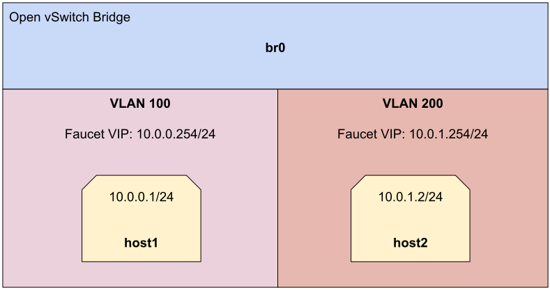

Connection tracking tutorial
============================

This tutorial will cover the use of the OVS connection tracking system (aka `conntrack`)
in conjunction with Faucet.

We will explore using the conntrack module to implement:

    - Stateful firewall rules via conntrack ACLs
    - Source Network Address Translation (sNAT)

Prerequisites
^^^^^^^^^^^^^

- A basic understanding of OVS connection tracking concepts. The `OVS Conntrack Tutorial
  <https://docs.openvswitch.org/en/latest/tutorials/ovs-conntrack/>`_ is a good starting
  point.
- A good understanding of the previous tutorial topics
  (:doc:`acls`, :doc:`vlans`, :doc:`routing`)
- Install Faucet - :ref:`tutorial-package-installation` steps 1 & 2
- Install Open vSwitch - :ref:`tutorial-first-datapath-connection` steps 1 & 2

- Install the `conntrack command line utility
  <https://manpages.debian.org/testing/conntrack/conntrack.8.en.html>`_

    .. code:: console

        sudo apt-get install conntrack

- Useful Bash Functions - Copy and paste the following definitions into your
  bash terminal, or to make them persistent between sessions add them to the
  bottom of your .bashrc and run 'source .bashrc'.

    .. literalinclude:: ../_static/tutorial/as_ns
       :language: bash

    .. literalinclude::  ../_static/tutorial/create_ns
       :language: bash

    .. literalinclude:: ../_static/tutorial/cleanup
       :language: bash

- Run the cleanup script to remove old namespaces and switches:

    .. code:: console

        cleanup

.. _tutorial-conntrack:

Stateful Firewall Rules
^^^^^^^^^^^^^^^^^^^^^^^

Let's start with a single switch connected to two hosts in two different VLANs, reusing
a setup from the :doc:`routing`.

.. code:: console

    create_ns host1 10.0.0.1/24
    create_ns host2 10.0.1.2/24
    sudo ovs-vsctl add-br br0 \
    -- set bridge br0 other-config:datapath-id=0000000000000001 \
    -- set bridge br0 other-config:disable-in-band=true \
    -- set bridge br0 fail_mode=secure \
    -- add-port br0 veth-host1 -- set interface veth-host1 ofport_request=1 \
    -- add-port br0 veth-host2 -- set interface veth-host2 ofport_request=2 \
    -- set-controller br0 tcp:127.0.0.1:6653

We begin with the following Faucet configuration.

.. code-block:: yaml
    :caption: /etc/faucet/faucet.yaml
    :name: intervlan-firewall-yaml

    vlans:
        vlan100:
            vid: 100
            faucet_vips: ["10.0.0.254/24"]  # Faucet's virtual IP address for vlan100
            faucet_mac: "00:00:00:00:00:11"
        vlan200:
            vid: 200
            faucet_vips: ["10.0.1.254/24"]  # Faucet's virtual IP address for vlan200
            faucet_mac: "00:00:00:00:00:22"
    dps:
        sw1:
            dp_id: 0x1
            hardware: "Open vSwitch"
            interfaces:
                1:
                    name: "host1"
                    description: "host1 network namespace"
                    native_vlan: vlan100
                2:
                    name: "host2"
                    description: "host2 network namespace"
                    native_vlan: vlan200
    routers:
        router-1:                           # Router name
            vlans: [vlan100, vlan200]       # Names of vlans to allow routing between

Now let's signal Faucet to reload the configuration file, which simply enables and
permits the two hosts to communicate.

.. code:: console

    sudo systemctl reload faucet

Add a default route on each host to set the gateway to the value we used for
``faucet_vips`` above.

.. code:: console

    as_ns host1 ip route add default via 10.0.0.254 dev veth0
    as_ns host2 ip route add default via 10.0.1.254 dev veth0

By default and without any ACLs, traffic is now permitted in either direction between
both hosts. We can show that by doing the following:

.. code:: console

    as_ns host1 ping 10.0.1.2
    as_ns host2 ping 10.0.0.1

In this section we will be using Faucet as a gateway and stateful firewall between our
two hosts. In this case, host1 is permitted to initiate connections to host2, but not
vice-versa. We will implement stateful firewall rules to track egress connections from
host1 to host2, allowing return packets from host2 to host1, but blocking new
connections initiated by host2 to host1. This is accomplished by using a new ACL
`action` option that we haven't seen before.

.. list-table::
    :widths: 8 70

    * - ct
      - Used to apply connection tracking to the specified flow.

We will now restrict communication between the two hosts by adding a connection tracking
ACL that permits egress communication from host1 to host2, but not vice-versa. Add the
following ACLs to the configuration file.

.. code-block:: yaml
    :caption: /etc/faucet/faucet.yaml

    acls:
        conntrack_fw:
            # Permit all ARP traffic such that hosts can resolve one another's MACs
            - rule:
                eth_type: 0x0806 # arp
                actions:
                    allow: True
            # Begin tracking ALL untracked IPv4 connections
            - rule:
                eth_type: 0x0800 # ipv4
                ct_state: 0/0x20  # match -trk (untracked)
                actions:
                    # Re-inject the tracked packet into the OpenFlow pipeline, containing
                    # additional connection metadata, to default table 0. The tracked packet
                    # is again evaluated by Faucet ACLs in table 0. The original, untracked
                    # packet is effectively dropped.
                    ct:
                        zone: 10 # arbitrary conntrack zone ID to match against later
                        table: 0
            # Commit NEW IPv4 connections from host1 to host2
            - rule:
                eth_type: 0x0800 # ipv4
                ipv4_src: 10.0.0.1
                ipv4_dst: 10.0.1.2
                ct_state: 0x21/0x21 # match +new - packets to establish a new connection
                actions:
                    # Commit the connection to the connection tracking module which will be
                    # stored beyond the lifetime of packet in the pipeline.
                    ct:
                        zone: 10  # the same conntrack zone ID as above
                        flags: 1  # "commit" the new connection
                        table: 1  # implicit "allow" new connection packet(s) via faucet table 1
            # Allow packets in either direction from existing connections initiated by
            # host1 only
            - rule:
                eth_type: 0x0800 # ipv4
                ct_zone: 10 # match packets associated with our conntrack zone ID
                ct_state: 0x22/0x22 # match +est - packets in an established connection
                actions:
                    allow: True
            # Block all unwanted packets and new connections from host2 to host1
            - rule:
                eth_type: 0x0800 # ipv4
                ipv4_src: 10.0.1.2
                ipv4_dst: 10.0.0.1
                actions:
                    allow: False

Be sure to also apply the new ACL to both ports in the data plane.

.. code-block:: yaml
    :caption: /etc/faucet/faucet.yaml

    dps:
        sw1:
            1:
                ...
                acls_in:
                - conntrack_fw
            2:
                ...
                acls_in:
                - conntrack_fw

Reload Faucet to apply the new configuration.

.. code:: console

    sudo systemctl reload faucet

The new conntrack related ACLs should have been added:

.. code:: console

    ovs-ofctl dump-flows br0 -O OpenFlow13 | grep =ct

We can debug how OVS interfaces with the conntrack module to deal with the tracked
packet(s).

.. code:: console

    ovs-appctl ofproto/trace br0 in_port=1,tcp,nw_src=10.0.0.1,nw_dst=10.0.1.2

Our ping from host1 to host2 should continue to work, establishing an entry in the
connection tracker. 

.. code:: console

    as_ns host1 ping 10.0.1.2

An entry for the ping should now be visible in the kernel's connection tracking table.

.. code:: console

    sudo conntrack -L | grep 10.0.1.2

However, ping and any other unrelated traffic from host2 to host1
is now denied.

.. code:: console

    ovs-appctl ofproto/trace br0 in_port=1,tcp,nw_src=10.0.1.2,nw_dst=10.0.0.1

    as_ns host2 ping 10.0.0.1

More-complex ACL rules can be created to build out an entire stateful firewall. It is
important to remember that ALL packets initially have a `ct_state` of -trk (untracked),
and must be sent to the connection tracking module via a `ct` action. Packets then pass
through the ACL(s) again, whereupon the `ct_state` and other fields can be matched
against to achieve the desired behavior. In order to track (i.e. "remember") a
connection, a packet from the connection must first be "committed" to the conntrack
module. Generally, it is best to do this for "new" egress connections in the permitted
direction, which allows subsequent ACLs to match against packets for established ("est")
connections in either direction. The `Connection Tracking Fields section
<https://man7.org/linux/man-pages/man7/ovs-fields.7.html#CONNECTION_TRACKING_FIELDS>`_
of the `ovs-fields(7)` man page is a helpful reference in understanding what the various
connection states mean.

Network Address Translation (NAT)
^^^^^^^^^^^^^^^^^^^^^^^^^^^^^^^^^

The connection tracking integration also allows changing the source/destination IP
and/or ports of a given connection. This can be used to implement one-to-one or
many-to-one sNAT (source-NAT) behavior seen in traditional NAT gateways.

We can extend our Stateful Firewall Rules ACL example to sNAT connections from host1 to
host2. We will NAT host1's IP to the Faucet VIP on its network, which is its gateway
(default route). Connections observed from host2 will appear to be initiated by the
Faucet VIP. This is accomplished by extending the `ct` action to include a `nat`
configuration field.

NAT configuration key/values are based on the related `Ryu configuration options
<https://ryu.readthedocs.io/en/latest/nicira_ext_ref.html?highlight=translation#ryu.ofproto.ofproto_v1_3_parser.NXActionNAT>`_.

The `Firewalling Actions section
<https://man7.org/linux/man-pages/man7/ovs-actions.7.html#FIREWALLING_ACTIONS>`_ of the
`ovs-actions(7)` man page is a helpful reference to understand how the NAT action
behaves. 

Now we augment the ACLs from the previous example with an additional `nat` option,
replacing them with the following:

.. code-block:: yaml
    :caption: /etc/faucet/faucet.yaml

    acls:
        conntrack_fw:
            - rule:
                eth_type: 0x0806 # arp
                actions:
                    allow: True
            - rule:
                eth_type: 0x0800 # ipv4
                ct_state: 0/0x20  # match -trk (untracked)
                actions:
                    ct:
                        zone: 10
                        table: 0
            - rule:
                eth_type: 0x0800 # ipv4
                ipv4_src: 10.0.0.1
                ipv4_dst: 10.0.1.2
                ct_state: 0x21/0x21 # match +new - packets to establish a new connection
                actions:
                    ct:
                        zone: 10
                        flags: 1  # "commit" the new connection
                        table: 1
                        # sNAT the connection to the faucet VIP
                        nat:
                            flags: 1
                            range_ipv4_min: 10.0.0.254
                            range_ipv4_max: 10.0.0.254
            - rule:
                eth_type: 0x0800 # ipv4
                ct_zone: 10
                ct_state: 0x22/0x22 # match +est - packets in an established connection
                actions:
                    ct:
                        zone: 10
                        flags: 1  # NAT must include "commit" - this is a NO-OP for existing connections
                        table: 1
                        # sNAT the packets in an existing connection appropriately according to their direction
                        nat:
                            flags: 1
            - rule:
                eth_type: 0x0800 # ipv4
                ipv4_src: 10.0.1.2
                ipv4_dst: 10.0.0.1
                actions:
                    allow: False

Reload Faucet to apply the new configuration.

.. code:: console

    sudo systemctl reload faucet

We can now see how OVS + conntrack will NAT the packets:

.. code:: console

    ovs-appctl ofproto/trace br0 in_port=1,tcp,nw_src=10.0.0.1,nw_dst=10.0.1.2

Our ping from host1 to host2 should continue to work, establishing an entry in the
connection tracker. This time, however, host1's source IP of 10.0.0.1 gets NATed to the
Faucet VIP of 10.0.0.254.

.. code:: console

    as_ns host1 ping 10.0.1.2

    tcpdump -n -e -ttt -i veth-host2 host 10.0.0.254

    sudo conntrack -L | grep 10.0.0.254

