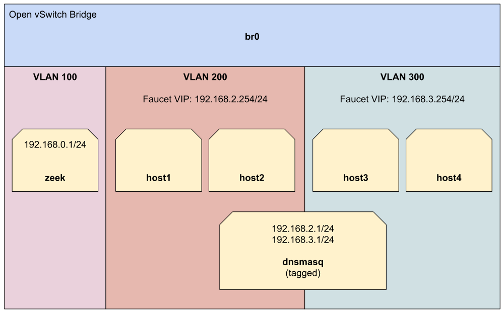

NFV services tutorial
=====================

This tutorial will cover using faucet with Network Function Virtualisation (NFV)
style services.

NFV services that will be demonstrated in this tutorial are:

    - DHCP/DNS server
    - `Zeek <https://www.zeek.org/>`_ (formerly known as Bro) Intrusion Detection System (IDS)

This tutorial demonstrates how the previous topics in this tutorial series can
be combined to run real world services on our network.

Prerequisites
^^^^^^^^^^^^^

- A good understanding of the previous tutorial topics
  (:doc:`acls`, :doc:`vlans`, :doc:`routing`)
- Install Faucet - :ref:`tutorial-package-installation` steps 1 & 2
- Install Open vSwitch - :ref:`tutorial-first-datapath-connection` steps 1 & 2
- Useful Bash Functions - Copy and paste the following definitions into your
  bash terminal, or to make them persistent between sessions add them to the
  bottom of your .bashrc and run 'source .bashrc'.

    .. literalinclude:: ../_static/tutorial/as_ns
       :language: bash

    .. literalinclude:: ../_static/tutorial/create_ns
       :language: bash

    .. literalinclude:: ../_static/tutorial/cleanup
       :language: bash

    .. literalinclude:: ../_static/tutorial/add_tagged_interface
       :language: bash

- Run the cleanup script to remove old namespaces and switches:

    .. code:: console

        cleanup

Network setup
^^^^^^^^^^^^^

The network will be divided into three VLANs, two of which are client VLANs
(200 & 300), with two clients in each and a DHCP/DNS server. There is also a
separate VLAN 100 for the Zeek server which we will mirror traffic two from the
other two VLANs.

To start, let's create our hosts and dnsmasq namespaces.

.. code:: console

    # DHCP/DNS server
    create_ns dnsmasq 0.0.0.0
    add_tagged_interface dnsmasq 200 192.168.2.1/24 # to serve VLAN 200
    add_tagged_interface dnsmasq 300 192.168.3.1/24 # to serve VLAN 300

    # VLAN 200 hosts
    create_ns host1 0.0.0.0
    create_ns host2 0.0.0.0
    # VLAN 300 hosts
    create_ns host3 0.0.0.0
    create_ns host4 0.0.0.0

Then create an Open vSwitch bridge and connect all hosts to it.

.. code:: console

    sudo ovs-vsctl add-br br0 \
    -- set bridge br0 other-config:datapath-id=0000000000000001 \
    -- set bridge br0 other-config:disable-in-band=true \
    -- set bridge br0 fail_mode=secure \
    -- add-port br0 veth-host1 -- set interface veth-host1 ofport_request=1 \
    -- add-port br0 veth-host2 -- set interface veth-host2 ofport_request=2 \
    -- add-port br0 veth-host3 -- set interface veth-host3 ofport_request=3 \
    -- add-port br0 veth-host4 -- set interface veth-host4 ofport_request=4 \
    -- add-port br0 veth-dnsmasq -- set interface veth-dnsmasq ofport_request=5 \
    -- set-controller br0 tcp:127.0.0.1:6653 tcp:127.0.0.1:6654

Dnsmasq setup
^^^^^^^^^^^^^

We will use `dnsmasq <http://www.thekelleys.org.uk/dnsmasq/doc.html>`_ to assign
IP addresses to our host namespaces via the DHCP protocol. It will also serve as
our DNS resolver for the hosts.

First install dnsmasq:

.. code:: console

    sudo apt-get install dnsmasq
    sudo systemctl stop dnsmasq

Run the following two commands to start two dnsmasq instances inside the dnsmasq
namespace. One instance will serve hosts on VLAN 200 and the other VLAN 300. We
will be providing DHCP leases in the supplied ranges, the lease will set the
gateway for each host to point at faucet's virtual IP and set dnsmasq as the
DNS resolver. We also provide a fake ``does.it.work`` DNS name which we will
later use to demonstrate DNS is working as expected.

.. code:: console

    # 192.168.2.0/24 for VLAN 200
    as_ns dnsmasq dnsmasq \
                       --dhcp-range=192.168.2.10,192.168.2.20 \
                       --dhcp-sequential-ip \
                       --dhcp-option=option:router,192.168.2.254 \
                       --no-resolv \
                       --txt-record=does.it.work,yes \
                       --bind-interfaces \
                       --except-interface=lo --interface=veth0.200 \
                       --dhcp-leasefile=/tmp/nfv-dhcp-vlan200.leases \
                       --log-facility=/tmp/nfv-dhcp-vlan200.log \
                       --pid-file=/run/dnsmasq-vlan200.pid \
                       --conf-file=

    # 192.168.3.0/24 for VLAN 300
    as_ns dnsmasq dnsmasq \
                       --dhcp-range=192.168.3.10,192.168.3.20 \
                       --dhcp-sequential-ip \
                       --dhcp-option=option:router,192.168.3.254 \
                       --no-resolv \
                       --txt-record=does.it.work,yes \
                       --bind-interfaces \
                       --except-interface=lo --interface=veth0.300 \
                       --dhcp-leasefile=/tmp/nfv-dhcp-vlan300.leases \
                       --log-facility=/tmp/nfv-dhcp-vlan300.log \
                       --pid-file=/run/dnsmasq-vlan300.pid \
                       --conf-file=

Now let's configure faucet.yaml.

.. code-block:: yaml
    :caption: /etc/faucet/faucet.yaml

    vlans:
        vlan200:
            vid: 200
            description: "192.168.2.0/24 network"
            faucet_vips: ["192.168.2.254/24"]
            faucet_mac: "00:00:00:00:00:22"
        vlan300:
            vid: 300
            description: "192.168.3.0/24 network"
            faucet_vips: ["192.168.3.254/24"]
            faucet_mac: "00:00:00:00:00:33"
    dps:
        sw1:
            dp_id: 0x1
            hardware: "Open vSwitch"
            interfaces:
                1:
                    name: "host1"
                    description: "host1 network namespace"
                    native_vlan: vlan200
                2:
                    name: "host2"
                    description: "host2 network namespace"
                    native_vlan: vlan200
                3:
                    name: "host3"
                    description: "host3 network namespace"
                    native_vlan: vlan300
                4:
                    name: "host4"
                    description: "host4 network namespace"
                    native_vlan: vlan300
                5:
                    name: "dnsmasq"
                    description: "dnsmasq server network namespace"
                    tagged_vlans: [vlan200, vlan300]

Now reload faucet configuration file.

.. code:: console

    sudo systemctl reload faucet

Use dhclient to configure host1 to host4 using DHCP (it may take a few seconds,
but should return when successful).

.. code:: console

    as_ns host1 dhclient -v -pf /run/dhclient-host1.pid -lf /run/dhclient-host1.leases veth0
    as_ns host2 dhclient -v -pf /run/dhclient-host2.pid -lf /run/dhclient-host2.leases veth0
    as_ns host3 dhclient -v -pf /run/dhclient-host3.pid -lf /run/dhclient-host3.leases veth0
    as_ns host4 dhclient -v -pf /run/dhclient-host4.pid -lf /run/dhclient-host4.leases veth0

If dhclient is unable to obtain an address you can check
*/tmp/nfv-dhcp-vlan<vlanid>.log* (e.g /tmp/nfv-dhcp-vlan300.leases) to check the log
messages from dnsmasq.

To look up the address for each namespace we can run the following commands:

.. code:: console

    as_ns host1 ip address show dev veth0
    as_ns host2 ip address show dev veth0
    as_ns host3 ip address show dev veth0
    as_ns host4 ip address show dev veth0

If the hosts have IPs then great our DHCP server works.

At the moment we should be able to ping inside VLAN 200 and VLAN 300:

.. code:: console

    as_ns host1 ping <ip of host2> # both in VLAN 200 should work
    as_ns host3 ping <ip of host4> # both in VLAN 300 should work

Pinging between VLANs will not currently work as we didn't turn on
inter-VLAN routing in our faucet configuration.

DNS
^^^

We can use faucet to enforce where protocols such as DNS go on the network. In
this section we will use a faucet ACL to rewrite DNS packets to allow our
dnsmasq namespace to answer DNS queries for any IP address.

Firstly, we can see that our dnsmasq server is correctly responding to DNS
requests by manually querying them:

.. code:: console

    as_ns host1 host -t txt does.it.work 192.168.2.1
    as_ns host3 host -t txt does.it.work 192.168.3.1

Both commands should return:

.. code:: console

    does.it.work descriptive text "yes"

But if we tried to query say ``8.8.8.8`` we would see this fail:

.. code:: console

    as_ns host1 host -t txt does.it.work 8.8.8.8

To make this work we first need the MAC address of the dnsmasq container:

.. code:: console

    as_ns dnsmasq cat /sys/class/net/veth0/address

    00:11:22:33:44:55

We now replace our previous faucet configuration with the configuration below
which adds an ACL that rewrites the MAC address of all DNS packets from the host
namespaces and sends these to our dnsmasq namespace. Make sure to update the
example MAC address of ``00:11:22:33:44:55`` with the one you get from running
the previous command.

.. code-block:: yaml
    :caption: /etc/faucet/faucet.yaml

    vlans:
        vlan200:
            vid: 200
            description: "192.168.2.0/24 network"
            faucet_vips: ["192.168.2.254/24"]
            faucet_mac: "00:00:00:00:00:22"
        vlan300:
            vid: 300
            description: "192.168.3.0/24 network"
            faucet_vips: ["192.168.3.254/24"]
            faucet_mac: "00:00:00:00:00:33"
    dps:
        sw1:
            dp_id: 0x1
            hardware: "Open vSwitch"
            interfaces:
                1:
                    name: "host1"
                    description: "host1 network namespace"
                    native_vlan: vlan200
                    acls_in: [nfv-dns, allow-all]
                2:
                    name: "host2"
                    description: "host2 network namespace"
                    native_vlan: vlan200
                    acls_in: [nfv-dns, allow-all]
                3:
                    name: "host3"
                    description: "host3 network namespace"
                    native_vlan: vlan300
                    acls_in: [nfv-dns, allow-all]
                4:
                    name: "host4"
                    description: "host4 network namespace"
                    native_vlan: vlan300
                    acls_in: [nfv-dns, allow-all]
                5:
                    name: "dnsmasq"
                    description: "dnsmasq server network namespace"
                    tagged_vlans: [vlan200, vlan300]
    acls:
        nfv-dns:
            # Force UDP DNS to our DNS server
            - rule:
                dl_type: 0x800      # ipv4
                nw_proto: 17        # udp
                udp_dst: 53         # dns
                actions:
                    output:
                        set_fields:
                            - eth_dst: "00:11:22:33:44:55" # MAC address of dnsmasq namespace
                    allow: True
            # Force TCP DNS to our DNS server
            - rule:
                dl_type: 0x800      # ipv4
                nw_proto: 6         # tcp
                tcp_dst: 53         # dns
                actions:
                    output:
                        set_fields:
                            - eth_dst: "00:11:22:33:44:55" # MAC address of dnsmasq namespace
                    allow: True
        allow-all:
            - rule:
                actions:
                    allow: True

As usual reload faucet configuration file.

.. code:: console

    sudo systemctl reload faucet

The next step is to configure the namespace to be able to handle incoming DNS
packets with any IP, this can be done by adding some rules to iptables that
will NAT all DNS traffic to the IP address of the VLAN interface:

.. code:: console

    as_ns dnsmasq iptables -t nat -A PREROUTING -i veth0.200 -p udp --dport 53 -j DNAT --to-destination 192.168.2.1
    as_ns dnsmasq iptables -t nat -A PREROUTING -i veth0.200 -p tcp --dport 53 -j DNAT --to-destination 192.168.2.1
    as_ns dnsmasq iptables -t nat -A PREROUTING -i veth0.300 -p udp --dport 53 -j DNAT --to-destination 192.168.3.1
    as_ns dnsmasq iptables -t nat -A PREROUTING -i veth0.300 -p tcp --dport 53 -j DNAT --to-destination 192.168.3.1

Now we should be able to query any IP address from the hosts and get a valid
DNS response:

.. code:: console

    as_ns host1 host -t txt does.it.work 8.8.8.8
    as_ns host2 host -t txt does.it.work 8.8.4.4

Zeek IDS
^^^^^^^^

We will now add an IDS to our network on it's on separate VLAN and use faucet
to mirror packets from VLAN 200 and 300 to the IDS VLAN.

Zeek installation
-----------------

We need first to install Zeek (formerly known as Bro).

.. code:: console

    sudo apt-get install bro broctl

Configure Zeek
--------------

In /etc/bro/node.cfg, set veth0 as the interface to monitor

.. code-block:: cfg
    :caption: /etc/bro/node.cfg

    [bro]
    type=standalone
    host=localhost
    interface=veth0

Comment out MailTo in /etc/bro/broctl.cfg

.. code-block:: cfg
    :caption: /etc/bro/broctl.cfg

    # Recipient address for all emails sent out by bro and BroControl.
    # MailTo = root@localhost

Run Zeek
--------

Firstly, let's create a namespace to run Zeek inside:

.. code:: console

    create_ns zeek 192.168.0.1
    sudo ovs-vsctl add-port br0 veth-zeek -- set interface veth-zeek ofport_request=6

Since this is the first-time use of the Zeek command shell application, perform
an initial installation of the BroControl configuration:

.. code:: console

    as_ns zeek broctl install

Then start Zeek instant

.. code:: console

    as_ns zeek broctl start

Check Zeek status

.. code:: console

    as_ns zeek broctl status

    Name         Type       Host          Status    Pid    Started
    bro          standalone localhost     running   15052  07 May 09:03:59

Now let's add a mirror ACL so all VLAN 200 & VLAN 300 traffic is sent to Zeek.

We will use a VLAN ACLs similar to the previous VLAN tutorial. Copy and paste
the entire configuration below into faucet.yaml.

.. code-block:: yaml
    :caption: /etc/faucet/faucet.yaml

    acls:
        mirror-acl:
            - rule:
                actions:
                    allow: true
                    mirror: zeek
    vlans:
        zeek-vlan:
            vid: 100
            description: "Zeek IDS network"
        vlan200:
            vid: 200
            description: "192.168.2.0/24 network"
            faucet_vips: ["192.168.2.254/24"]
            faucet_mac: "00:00:00:00:00:22"
            acls_in: [mirror-acl]
        vlan300:
            vid: 300
            description: "192.168.3.0/24 network"
            faucet_vips: ["192.168.3.254/24"]
            faucet_mac: "00:00:00:00:00:33"
            acls_in: [mirror-acl]
    dps:
        sw1:
            dp_id: 0x1
            hardware: "Open vSwitch"
            interfaces:
                1:
                    name: "host1"
                    description: "host1 network namespace"
                    native_vlan: vlan200
                2:
                    name: "host2"
                    description: "host2 network namespace"
                    native_vlan: vlan200
                3:
                    name: "host3"
                    description: "host3 network namespace"
                    native_vlan: vlan300
                4:
                    name: "host4"
                    description: "host4 network namespace"
                    native_vlan: vlan300
                5:
                    name: "dnsmasq"
                    description: "dnsmasq server network namespace"
                    tagged_vlans: [vlan200, vlan300]
                6:
                    name: "zeek"
                    description: "Zeek network namespace"
                    native_vlan: zeek-vlan

As usual reload faucet configuration file.

.. code:: console

    sudo systemctl reload faucet

If we generate some DNS traffic on either of the hosts VLANs

.. code:: console

    as_ns host4 host -t txt does.it.work 192.168.3.1

Then if we inspect the Zeek logs for DNS ``/var/log/bro/current/dns.log``, we
should see that Zeek has seen the DNS queries and logged these.

.. code-block:: text
    :caption: /var/log/bro/current/dns.log

    #separator \x09
    #set_separator	,
    #empty_field	(empty)
    #unset_field	-
    #path	dns
    #open	2019-01-17-17-43-56
    #fields	ts	uid	id.orig_h	id.orig_p	id.resp_h	id.resp_p	proto	trans_id	rtt	query	qclass	qclass_name	qtype	qtype_name	rcode	rcode_name	AA	TC	RD	RA	Z	answers	TTLs	rejected
    #types	time	string	addr	port	addr	port	enum	count	interval	string	count	string	count	string	count	string	bool	bool	bool	bool	count	vector[string]	vector[interval]	bool
    1547700236.794299	CsulWM1Px7fIyPpCVi	192.168.3.10	43428	192.168.3.1	53	udp	14288	0.006973does.it.work	1	C_INTERNET	16	TXT	0	NOERROR	T	F	T	T	2	TXT 3 yes	0.000000	F
    1547700379.311319	CZa11oBd3CgWBmgS8	192.168.3.11	45089	192.168.3.1	53	udp	64001	0.000336does.it.work	1	C_INTERNET	16	TXT	0	NOERROR	T	F	T	T	0	TXT 3 yes	0.000000	F

You can also check if the traffic is being mirrored as expected using
``tcpdump`` in the ``zeek`` network namespace:

.. code:: console

    as_ns zeek sudo tcpdump -i veth0 -n -l

in one window, and then generating some more DNS traffic, eg:

.. code:: console

    as_ns host4 host -t txt does.it.work 192.168.3.1

then you should see something like:

.. code-block:: text
    :caption: zeek namespace tcpdump output

    tcpdump: verbose output suppressed, use -v or -vv for full protocol decode
    listening on veth0, link-type EN10MB (Ethernet), capture size 262144 bytes
    12:19:24.624244 IP 192.168.3.13.38174 > 192.168.3.1.53: 64571+ TXT? does.it.work. (30)
    12:19:24.625109 IP 192.168.3.1.53 > 192.168.3.13.38174: 64571* 1/0/0 TXT "yes" (46)
