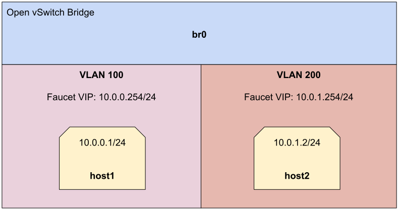

Routing tutorial
================

This tutorial will cover routing with Faucet.

There are three types of routing we can use.

    - Inter-VLAN routing
    - Static routing
    - BGP via an external application (Quagga, Bird, EXABGP, etc)

Prerequisites
^^^^^^^^^^^^^

- Install Faucet - :ref:`tutorial-package-installation` steps 1 & 2
- Install Open vSwitch - :ref:`tutorial-first-datapath-connection` steps 1 & 2
- Useful Bash Functions - Copy and paste the following definitions into your
  bash terminal, or to make them persistent between sessions add them to the
  bottom of your .bashrc and run 'source .bashrc'.

    .. literalinclude:: ../_static/tutorial/as_ns
       :language: bash

    .. literalinclude::  ../_static/tutorial/create_ns
       :language: bash

    .. literalinclude:: ../_static/tutorial/cleanup
       :language: bash

- Run the cleanup script to remove old namespaces and switches:

    .. code:: console

        cleanup

.. _tutorial-ivr:

Routing between VLANs
^^^^^^^^^^^^^^^^^^^^^

Let's start with a single switch connected to two hosts in two different VLANs.

.. code:: console

    create_ns host1 10.0.0.1/24
    create_ns host2 10.0.1.2/24
    sudo ovs-vsctl add-br br0 \
    -- set bridge br0 other-config:datapath-id=0000000000000001 \
    -- set bridge br0 other-config:disable-in-band=true \
    -- set bridge br0 fail_mode=secure \
    -- add-port br0 veth-host1 -- set interface veth-host1 ofport_request=1 \
    -- add-port br0 veth-host2 -- set interface veth-host2 ofport_request=2 \
    -- set-controller br0 tcp:127.0.0.1:6653 tcp:127.0.0.1:6654

In this section we will be using faucet as a gateway for our two hosts and
using faucet to route between them. To do this we are going to need to give
faucet an IP address on the network. This is accomplished with by using two new
options that we haven't seen before:

.. list-table::
    :widths: 15 85

    * - faucet_vips
      - The IP address for Faucet's routing interface on this VLAN. Multiple IP
        addresses (IPv4 & IPv6) can be used.
    * - faucet_mac
      - The MAC address of Faucet's routing interface on this VLAN.

Let's add the following faucet configuration which makes use of these options.

.. code-block:: yaml
    :caption: /etc/faucet/faucet.yaml
    :name: intervlan-routing-yaml

    vlans:
        vlan100:
            vid: 100
            faucet_vips: ["10.0.0.254/24"]  # Faucet's virtual IP address for vlan100
            faucet_mac: "00:00:00:00:00:11"
        vlan200:
            vid: 200
            faucet_vips: ["10.0.1.254/24"]  # Faucet's virtual IP address for vlan200
            faucet_mac: "00:00:00:00:00:22"
    dps:
        sw1:
            dp_id: 0x1
            hardware: "Open vSwitch"
            interfaces:
                1:
                    name: "host1"
                    description: "host1 network namespace"
                    native_vlan: vlan100
                2:
                    name: "host2"
                    description: "host2 network namespace"
                    native_vlan: vlan200

Now lets signal faucet to reload the configuration file.

.. code:: console

    sudo systemctl reload faucet

Add a default route on each host to set the gateway to the value we used for
``faucet_vips`` above.

.. code:: console

    as_ns host1 ip route add default via 10.0.0.254 dev veth0
    as_ns host2 ip route add default via 10.0.1.254 dev veth0

By default traffic between our two hosts will be dropped since they are in
different VLANs with different subnets. We can show that by doing the following:

.. code:: console

    as_ns host1 ping 10.0.1.2

We can change this by enabling
inter-VLAN routing between these two VLANs. In faucet you do this by creating a
router and specifying which VLANs can route between each other.

In our case we to enable routing between VLAN 100 and VLAN 200 so we add the
following to our configuration file.

.. code-block:: yaml
    :caption: /etc/faucet/faucet.yaml

    routers:
        router-1:                           # Router name
            vlans: [vlan100, vlan200]       # Names of vlans to allow routing between

Reload faucet to enable inter-VLAN routing.

.. code:: console

    sudo systemctl reload faucet

Our ping before from host1 to host2 should now work (the first few packets may
get lost as faucet needs to resolve the MAC address of the next hop with ARP).

.. code:: console

    as_ns host1 ping 10.0.1.2

Inter-VLAN routing by default will allow all traffic to pass between VLANs, if
we wanted to change this and restrict communication to a few different IP
addresses or TCP/UDP ports, we could apply a VLAN ACL to each VLAN to limit the
types of traffic that may pass and what should be dropped.

Static routing
^^^^^^^^^^^^^^

For this we will set-up a Faucet switch with three hosts.
One of these hosts will act like a server.

Run the cleanup script to remove old namespaces and switches.

.. code:: console

    cleanup

Create 3 hosts, in 2 different subnets:

.. code:: console

    create_ns host1 10.0.0.1/24
    create_ns host2 10.0.0.2/24
    create_ns server 10.0.1.1/24

Add a default route for each host to the gateway which is faucet's virtual
IP address.

.. code:: console

    as_ns host1 ip route add default via 10.0.0.254
    as_ns host2 ip route add default via 10.0.0.254
    as_ns server ip route add default via 10.0.1.254

Create the bridge and add host1, host2 and the server to br0.

.. code:: console

    sudo ovs-vsctl add-br br0 \
    -- set bridge br0 other-config:datapath-id=0000000000000001 \
    -- set bridge br0 other-config:disable-in-band=true \
    -- set bridge br0 fail_mode=secure \
    -- add-port br0 veth-host1 -- set interface veth-host1 ofport_request=1 \
    -- add-port br0 veth-host2 -- set interface veth-host2 ofport_request=2 \
    -- add-port br0 veth-server -- set interface veth-server ofport_request=3 \
    -- set-controller br0 tcp:127.0.0.1:6653 tcp:127.0.0.1:6654

For this Faucet configuration we will start from scratch. First we need to
define 2 VLANs one for hosts and one for servers. We will also note that
inside the configuration for the servers VLAN we see a static route that routes
the subnet ``192.0.2.0/24`` to the server namespace (10.0.1.1).

.. code-block:: yaml
    :caption: /etc/faucet/faucet.yaml

    vlans:
        hosts:
            vid: 100
            description: "vlan for clients"
            faucet_mac: "00:00:00:00:00:11"
            faucet_vips: ["10.0.0.254/24"]

        servers:
            vid: 200
            description: "vlan for servers"
            faucet_mac: "00:00:00:00:00:22"
            faucet_vips: ["10.0.1.254/24"]
            routes:
                - route:
                    ip_dst: "192.0.2.0/24"
                    ip_gw: '10.0.1.1'
    routers:
        router-hosts-servers:
            vlans: [hosts, servers]
    dps:
        br0:
            dp_id: 0x1
            hardware: "Open vSwitch"
            interfaces:
                1:
                    name: "host1"
                    description: "host1 network namespace"
                    native_vlan: hosts
                2:
                    name: "host2"
                    description: "host2 network namespace"
                    native_vlan: hosts
                3:
                    name: "server"
                    description: "server network namespace"
                    native_vlan: servers

Reload Faucet to apply the new configuration.

.. code:: console

    sudo systemctl reload faucet

We can verify the inter-VLAN Routing is working by pinging the IP address of the
server namespace:

.. code:: console

    as_ns host1 ping 10.0.1.1

We also need to add an additional IP alias to server to test the static route
works.

.. code:: console

    as_ns server ip address add 192.0.2.1/24 dev veth0

And we should now be able to ping our IP alias.

.. code:: console

    as_ns host1 ping 192.0.2.1

BGP routing
^^^^^^^^^^^

For this section we are going to change our static routes from above into BGP routes.

BGP (and other routing) is provided by a NFV service, here we will use
`BIRD <http://bird.network.cz/>`_. Other applications such as ExaBGP & Quagga
could be used. Faucet imports all routes provided by this NFV service.
This means we can use our service for other routing protocols (OSPF, RIP, etc)
and apply filtering using the service's policy language.

Setup
-----

Our data plane will end up looking like below, you may notice how we have the
Faucet application connected to the control plane and dataplane.

Remove the following lines from ``/etc/faucet/faucet.yaml`` to remove
the static route from faucet:

.. code-block:: yaml
    :caption: /etc/faucet/faucet.yaml

    routes:
        - route:
          ip_dst: "192.0.2.0/24"
          ip_gw: '10.0.1.1'

Reload Faucet

.. code:: console

    sudo systemctl reload faucet

Verify that we can no longer ping the address we were previously static routing.

.. code:: console

    as_ns host1 ping 192.0.2.1

Let's add a new network namespace to run BIRD

.. code:: console

    create_ns bgp 10.0.1.2/24
    sudo ovs-vsctl add-port br0 veth-bgp -- set interface veth-bgp ofport_request=4

Next we will add a dataplane connection for Faucet so that it can communicate
with BIRD running on the bgp namespace.

.. code:: console

    sudo ip link add veth-faucet type veth peer name veth-faucet-ovs
    sudo ovs-vsctl add-port br0 veth-faucet-ovs -- set interface veth-faucet-ovs ofport_request=5
    sudo ip addr add 10.0.1.3/24 dev veth-faucet
    sudo ip link set veth-faucet up
    sudo ip link set veth-faucet-ovs up

Now install BIRD on the system and stop it from running:

.. code:: console

    sudo apt-get install bird
    sudo systemctl stop bird
    sudo systemctl stop bird6

To configure BIRD add the following to ``/etc/bird/bird.conf``, this will create
a simple routing setup where BIRD originates a static route for 192.0.2.0/24 and
sends this to faucet over BGP.

.. code-block:: cfg
    :caption: /etc/bird/bird.conf

    protocol kernel {
        scan time 60;
        import none;
    }

    protocol device {
        scan time 60;
    }

    # Generate static route inside bird
    protocol static {
        route 192.0.2.0/24 via 10.0.1.1;
    }

    # BGP peer with faucet
    # Import all routes and export our static route
    protocol bgp faucet {
        local as 65001;
        neighbor 10.0.1.3 port 9179 as 65000;
        export all;
        import all;
    }

We can now start BIRD inside the bgp namespace:

.. code:: console

    as_ns bgp bird -P /run/bird-bgp.pid

We'll configure Faucet to talk to BIRD by adding BGP configuration to
``/etc/faucet/faucet.yaml``. Add the following to the routers section.

.. code-block:: yaml
    :caption: /etc/faucet/faucet.yaml

    routers:
        ...
        bird:
            bgp:
                vlan: servers                       # The VLAN faucet use for BGP
                as: 65000                           # Faucet's AS number
                port: 9179                          # BGP port for Faucet to listen on.
                routerid: '10.0.1.3'                # Faucet's Unique ID.
                server_addresses: ['10.0.1.3']      # Faucet's listen IP for BGP
                neighbor_addresses: ['10.0.1.2']    # Neighbouring IP addresses (IPv4/IPv6)
                neighbor_as: 65001                  # Neighbour's AS number

And finally add the port configuration for the Faucet data plane interface (veth-faucet0).

.. code-block:: yaml
    :caption: /etc/faucet/facuet.yaml

    dps:
        br0:
            ...
            interfaces:
                ...
                4:
                    name: "bgp"
                    description: "BIRD BGP router"
                    native_vlan: servers
                5:
                    name: "faucet"
                    description: "faucet dataplane connection"
                    native_vlan: servers

Now reload Faucet.

.. code:: console

    sudo systemctl reload faucet

We can use the command line tool ``birdc`` to query the status of our peering
connection, we should see that it is now established:

.. code-block:: console

    as_ns bgp birdc show protocols all faucet

    name     proto    table    state  since       info
    faucet   BGP      master   up     13:25:38    Established
      Preference:     100
      Input filter:   ACCEPT
      Output filter:  ACCEPT
      Routes:         1 imported, 1 exported, 1 preferred
      Route change stats:     received   rejected   filtered    ignored   accepted
        Import updates:              1          0          0          0          1
        Import withdraws:            0          0        ---          0          0
        Export updates:              2          1          0        ---          1
        Export withdraws:            0        ---        ---        ---          0
      BGP state:          Established
        Neighbor address: 10.0.1.3
        Neighbor AS:      65000
        Neighbor ID:      10.0.1.3
        Neighbor caps:    AS4
        Session:          external AS4
        Source address:   10.0.1.2
        Hold timer:       185/240
        Keepalive timer:  57/80

Using ``birdc`` we can also check what routes are being exported to faucet:

.. code-block:: console

    as_ns bgp birdc show route export faucet

    192.0.2.0/24       via 10.0.1.1 on veth0 [static1 13:25:34] * (200)

And which routes bird receives from faucet:

.. code-block:: console

    as_ns bgp birdc show route protocol faucet

    10.0.1.0/24        via 10.0.1.254 on veth0 [faucet 13:25:38 from 10.0.1.3] * (100) [i]

In ``/var/log/faucet/faucet.log`` we should now see log messages relating to BGP:

.. code-block:: console
    :caption: /var/log/faucet/faucet.log

    Jan 16 13:25:17 faucet       INFO     Reloading configuration
    Jan 16 13:25:17 faucet       INFO     configuration /etc/faucet/faucet.yaml changed, analyzing differences
    Jan 16 13:25:17 faucet       INFO     Add new datapath DPID 1 (0x1)
    Jan 16 13:25:17 faucet       INFO     Adding BGP speaker key DP ID: 1, VLAN VID: 200, IP version: 4 for VLAN servers vid:200 untagged: Port 3,Port 4,Port 5
    Jan 16 13:25:38 faucet       INFO     BGP peer router ID 10.0.1.2 AS 65001 up
    Jan 16 13:25:38 faucet       INFO     BGP add 192.0.2.0/24 nexthop 10.0.1.1
    Jan 16 13:25:42 faucet.valve INFO     DPID 1 (0x1) br0 resolving 10.0.1.1 (1 flows) on VLAN 200
    Jan 16 13:25:42 faucet.valve INFO     DPID 1 (0x1) br0 Adding new route 192.0.2.0/24 via 10.0.1.1 (aa:97:cd:33:74:a9) on VLAN 200

Once confirming the BGP connection is up between BIRD and faucet and the correct
routes are being advertised, we should now be able to ping the IP alias on the
server namespace again:

.. code:: console

    as_ns host1 ping 192.0.2.1
