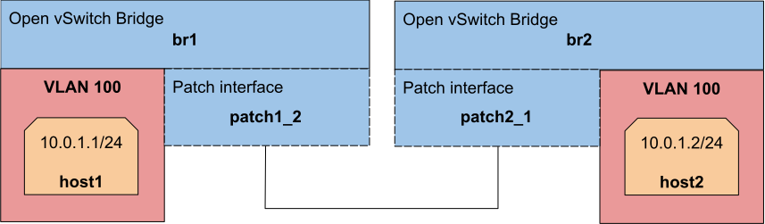
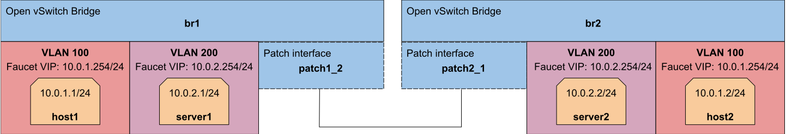
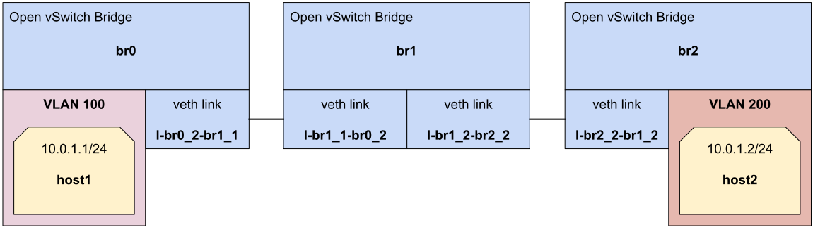
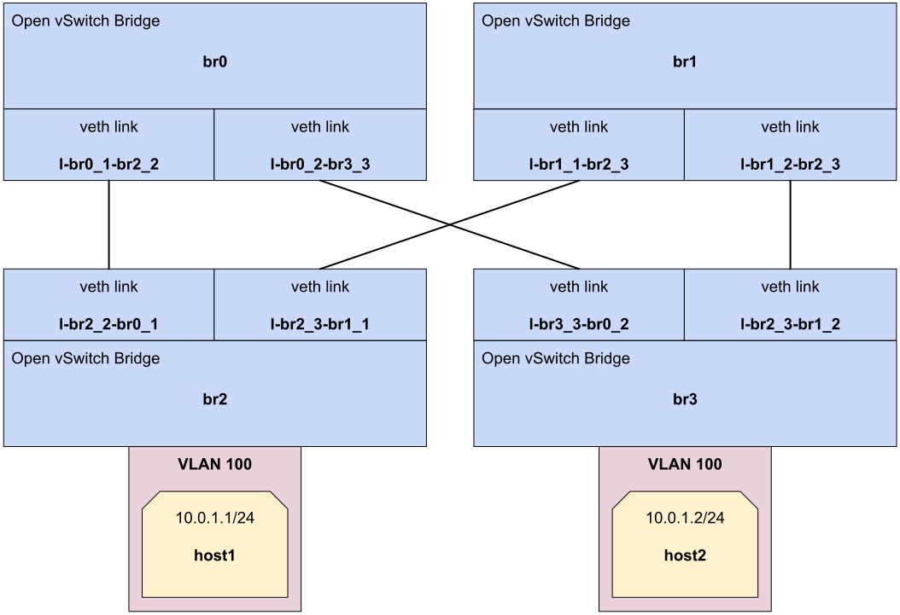

Stacking tutorial
=================

Faucet has two primary modes of operation:
independent switching and distributed switching.

In independent mode each decision about the network (learning, routing, etc) is
made in the context of each individual switch.

This tutorial will cover Faucet's distributed switching (a.k.a stacking) mode.
Stacking allows decisions such as switching and routing to be made in the
context of the whole network. This has great benefits for building resilient
network topologies that can automatically recover from switch and port/cable
failures. In this tutorial we will cover some of the new features and
demonstrate how they work.

Prerequisites
^^^^^^^^^^^^^

- Knowledge of the VLAN and routing tutorial topics (:doc:`vlans`, :doc:`routing`)
- Install Faucet - :ref:`tutorial-package-installation` steps 1 & 2
- Install Open vSwitch - :ref:`tutorial-first-datapath-connection` steps 1 & 2
- Useful Bash Functions - Copy and paste the following definitions into your
  bash terminal, or to make them persistent between sessions add them to the
  bottom of your .bashrc and run 'source .bashrc'.

    .. literalinclude::  ../_static/tutorial/create_ns
       :language: bash

    .. literalinclude:: ../_static/tutorial/as_ns
       :language: bash

    .. literalinclude:: ../_static/tutorial/inter_switch_link
       :language: bash

    .. literalinclude:: ../_static/tutorial/cleanup
       :language: bash

- Run the cleanup script to remove old namespaces and switches:

    .. code:: console

        cleanup

.. _tutorial-stacking:

Basic stacking
^^^^^^^^^^^^^^

We can start by considering two switches with one host on each switch on the same VLAN.

Let's define a simple base faucet.yaml to get started:

.. code-block:: yaml
    :caption: /etc/faucet/faucet.yaml
    :name: multiple-switches-yaml

    vlans:
        hosts:
            vid: 100
    dps:
        br0:
            dp_id: 0x1
            hardware: "Open vSwitch"
            interfaces:
                1:
                    description: "host1 network namespace"
                    native_vlan: hosts
        br1:
            dp_id: 0x2
            hardware: "Open vSwitch"
            interfaces:
                1:
                    description: "host2 network namespace"
                    native_vlan: hosts

Now lets signal faucet to reload the configuration file.

.. code:: console

    sudo systemctl reload faucet

We need to create our two hosts, host1 and host2.

.. code:: console

   create_ns host1 10.0.1.1/24
   create_ns host2 10.0.1.2/24

To setup multiple switches in Open vSwitch we can define two bridges with different datapath-ids and names.
We'll be using br0 and br1.

.. code:: console

   sudo ovs-vsctl add-br br0 \
   -- set bridge br0 other-config:datapath-id=0000000000000001 \
   -- set bridge br0 other-config:disable-in-band=true \
   -- set bridge br0 fail_mode=secure \
   -- add-port br0 veth-host1 -- set interface veth-host1 ofport_request=1 \
   -- set-controller br0 tcp:127.0.0.1:6653 tcp:127.0.0.1:6654

   sudo ovs-vsctl add-br br1 \
   -- set bridge br1 other-config:datapath-id=0000000000000002 \
   -- set bridge br1 other-config:disable-in-band=true \
   -- set bridge br1 fail_mode=secure \
   -- add-port br1 veth-host2 -- set interface veth-host2 ofport_request=1 \
   -- set-controller br1 tcp:127.0.0.1:6653 tcp:127.0.0.1:6654

Since the switches are not connected it will be impossible to ping between the two hosts.

.. code:: console

   as_ns host1 ping 10.0.1.2

To connect the switches we can use the Faucet switch stacking feature.
First, we need to define a root switch for our stack by setting a ``stack priority``
value for br0, the datapath with the lowest priority will be root.
Second, we need to add stack interfaces connecting each datapath, we do this by defining
the ``stack`` parameter on an interface. When defining a stack interface we say
which datapath (dp) and port the other end of the cable is connected to.

Replace your base faucet.yaml from earlier with this version with stacking enabled:

.. code-block:: yaml
    :caption: /etc/faucet/faucet.yaml
    :name: switch-stacking-yaml

    vlans:
        hosts:
            vid: 100
    dps:
        br0:
            dp_id: 0x1
            hardware: "Open vSwitch"
            stack:
                priority: 1
            interfaces:
                1:
                    description: "host1 network namespace"
                    native_vlan: hosts
                2:
                    description: "br0 stack link to br1"
                    stack:
                        dp: br1
                        port: 2
        br1:
            dp_id: 0x2
            hardware: "Open vSwitch"
            interfaces:
                1:
                    description: "host2 network namespace"
                    native_vlan: hosts
                2:
                    description: "br1 stack link to br0"
                    stack:
                       dp: br0
                       port: 2

To connect two Open vSwitch bridges we can use a veth interface pair.
We will use the ``inter_switch_link`` function we defined earlier to connect
br0 port 2 to br1 port 2:

.. code:: console

   inter_switch_link br0:2 br1:2

Let's reload Faucet and see what happens.

.. code:: console

   sudo systemctl reload faucet

Faucet will start sending out LLDP beacons to connect up the stack ports.
We can see this happening in the log file when the switches report that port 2 (the stack port) is UP.

.. code-block::
   :caption: /var/log/faucet/faucet.log
   :name: lldp-stack-log

   DPID 2 (0x2) br1 LLDP on 0e:00:00:00:00:01, Port 2 from 0e:00:00:00:00:01 (remote DPID 1 (0x1), port 2) state 2
   DPID 2 (0x2) br1 Stack Port 2 INIT
   DPID 1 (0x1) br0 LLDP on 0e:00:00:00:00:01, Port 2 from 0e:00:00:00:00:01 (remote DPID 2 (0x2), port 2) state 2
   DPID 1 (0x1) br0 Stack Port 2 INIT
   DPID 2 (0x2) br1 LLDP on 0e:00:00:00:00:01, Port 2 from 0e:00:00:00:00:01 (remote DPID 1 (0x1), port 2) state 1
   DPID 2 (0x2) br1 Stack Port 2 UP
   DPID 2 (0x2) br1 1 stack ports changed state
   DPID 1 (0x1) br0 LLDP on 0e:00:00:00:00:01, Port 2 from 0e:00:00:00:00:01 (remote DPID 2 (0x2), port 2) state 1
   DPID 1 (0x1) br0 Stack Port 2 UP
   DPID 1 (0x1) br0 1 stack ports changed state
   DPID 2 (0x2) br1 LLDP on 0e:00:00:00:00:01, Port 2 from 0e:00:00:00:00:01 (remote DPID 1 (0x1), port 2) state 3
   DPID 1 (0x1) br0 LLDP on 0e:00:00:00:00:01, Port 2 from 0e:00:00:00:00:01 (remote DPID 2 (0x2), port 2) state 3

.. note:: If we were to accidentally cable our switches incorrectly faucet would
          report the incorrect cabling in the log file.

Now that the two switches are connected and our stack is up, we can ping between the two hosts.

.. code:: console

   as_ns host1 ping 10.0.1.2

Inter-VLAN routing with stacking
^^^^^^^^^^^^^^^^^^^^^^^^^^^^^^^^

For this task we will see that inter-VLAN routing can work between hosts on different switches.

First run the cleanup.

.. code:: console

   cleanup

We can accomplish inter-VLAN routing between different switches by using the stacking feature.
To do this we will be combining the methods from the :ref:`tutorial-stacking` and the :ref:`tutorial-ivr` tutorials.

Here is a full faucet.yaml you can copy and paste that sets up our stack
topology and enables all the features we need.

.. code-block:: yaml
    :caption: /etc/faucet/faucet.yaml
    :name: ivr-switch-stacking-yaml

    vlans:
        hosts:
            vid: 100
            faucet_vips: ["10.0.1.254/24"]
            faucet_mac: "00:00:00:00:00:11"
        servers:
            vid: 200
            faucet_vips: ["10.0.2.254/24"]
            faucet_mac: "00:00:00:00:00:22"
    routers:
        router-1:
            vlans: [hosts, servers]
    dps:
        br0:
            dp_id: 0x1
            hardware: "Open vSwitch"
            stack:
                priority: 1
            interfaces:
                1:
                    description: "host1 network namespace"
                    native_vlan: hosts
                2:
                    description: "br0 stack link to br1"
                    stack:
                        dp: br1
                        port: 2
                3:
                    description: "server1 network namespace"
                    native_vlan: servers

        br1:
            dp_id: 0x2
            hardware: "Open vSwitch"
            interfaces:
                1:
                    description: "host2 network namespace"
                    native_vlan: hosts
                2:
                    description: "br1 stack link to br0"
                    stack:
                       dp: br0
                       port: 2
                3:
                    description: "server2 network namespace"
                    native_vlan: servers

Reload faucet to enable inter-VLAN routing.

.. code:: console

    sudo systemctl reload faucet

As we have learnt previously. First, set up the hosts:

.. code:: console

    create_ns host1 10.0.1.1/24
    create_ns host2 10.0.1.2/24
    create_ns server1 10.0.2.1/24
    create_ns server2 10.0.2.2/24

Now we can set-up the default routes for each host.

.. code:: console

   as_ns host1 ip route add default via 10.0.1.254
   as_ns host2 ip route add default via 10.0.1.254
   as_ns server1 ip route add default via 10.0.2.254
   as_ns server2 ip route add default via 10.0.2.254

Next, we can create the bridges.

.. code:: console

  sudo ovs-vsctl add-br br0 \
  -- set bridge br0 other-config:datapath-id=0000000000000001 \
  -- set bridge br0 other-config:disable-in-band=true \
  -- set bridge br0 fail_mode=secure \
  -- add-port br0 veth-host1 -- set interface veth-host1 ofport_request=1 \
  -- add-port br0 veth-server1 -- set interface veth-server1 ofport_request=3 \
  -- set-controller br0 tcp:127.0.0.1:6653 tcp:127.0.0.1:6654

  sudo ovs-vsctl add-br br1 \
  -- set bridge br1 other-config:datapath-id=0000000000000002 \
  -- set bridge br1 other-config:disable-in-band=true \
  -- set bridge br1 fail_mode=secure \
  -- add-port br1 veth-host2 -- set interface veth-host2 ofport_request=1 \
  -- add-port br1 veth-server2 -- set interface veth-server2 ofport_request=3 \
  -- set-controller br1 tcp:127.0.0.1:6653 tcp:127.0.0.1:6654

And finally, we can create the inter-switch links to connect the bridges to each other.

.. code:: console

   inter_switch_link br0:2 br1:2

Now it should be possible to ping between any combination of hosts on any VLAN
after the LLDP has configured the stack ports as UP. For example host1 can ping
to server1 on the same switch as well as server2 on the other switch via the use
of the stack link.

.. code:: console

   as_ns host1 ping 10.0.2.1
   as_ns host1 ping 10.0.2.2

Tunneling over a stack
^^^^^^^^^^^^^^^^^^^^^^

Faucet has a feature that allows us to tunnel packets from one datapath to
another without having to think about the underlying network topology. In this
example we have three switches and two hosts. We will create a tunnel that runs
over top of this topology connecting host1 and host2 together.

First run the cleanup.

.. code:: console

    cleanup

Now let's define our faucet.yaml that will make this network work. The
configuration file below defines our faucet stack topology and ports
for our host1 and host2. An important thing to note is that we define our two
hosts on separate VLANs so they should not be able to communicate.

The other thing to notice is the two ACLs we define, ``tunnel-to-host1`` and
``tunnel-to-host2``. At the moment these ACLs match all traffic (though we could
easily add a match here to only tunnel a subset of traffic, see :ref:`tutorial-acl`
for more details). Each tunnel sets the destination datapath and port for traffic
matching the ACL, we currently support one type of tunnel, VLAN, and must reserve
a tunnel VLAN here using the ``tunnel_id`` parameter (in future we could support
different types of tunnels).

The two ACLs are then applied to the ports host1 and host2 are connected to.

.. code-block:: yaml
    :caption: /etc/faucet/faucet.yaml
    :name: faucet-tunneling-yaml

    acls:
       tunnel-to-host1:
           - rule:
               actions:
                   output:
                       tunnel:
                           type: 'vlan'
                           tunnel_id: 901
                           dp: br0
                           port: 1
       tunnel-to-host2:
           - rule:
               actions:
                   output:
                       tunnel:
                           type: 'vlan'
                           tunnel_id: 902
                           dp: br2
                           port: 1
    vlans:
        host1:
           vid: 101
        host2:
           vid: 102
    dps:
        br0:
            dp_id: 0x1
            hardware: "Open vSwitch"
            stack:
                priority: 1
            interfaces:
                1:
                    description: "host1 network namespace"
                    native_vlan: host1
                    acl_in: tunnel-to-host2
                2:
                    description: "br0 stack link to br1"
                    stack:
                        dp: br1
                        port: 1
        br1:
            dp_id: 0x2
            hardware: "Open vSwitch"
            interfaces:
                1:
                    description: "br1 stack link to br0"
                    stack:
                       dp: br0
                       port: 2
                2:
                    description: "br1 stack link to br2"
                    stack:
                        dp: br2
                        port: 2
        br2:
            dp_id: 0x3
            hardware: "Open vSwitch"
            interfaces:
                1:
                    description: "host2 network namespace"
                    native_vlan: host2
                    acl_in: tunnel-to-host1
                2:
                    description: "br2 stack link to br1"
                    stack:
                        dp: br1
                        port: 2

When we have updated our configuration to match above, signal to faucet to
reload the configuration file.

.. code:: console

    sudo systemctl reload faucet

Then we can set up the hosts:

.. code:: console

    create_ns host1 10.0.1.1/24
    create_ns host2 10.0.1.2/24

Next, we can create the bridges.

.. code:: console

   sudo ovs-vsctl add-br br0 \
   -- set bridge br0 other-config:datapath-id=0000000000000001 \
   -- set bridge br0 other-config:disable-in-band=true \
   -- set bridge br0 fail_mode=secure \
   -- add-port br0 veth-host1 -- set interface veth-host1 ofport_request=1 \
   -- set-controller br0 tcp:127.0.0.1:6653 tcp:127.0.0.1:6654

   sudo ovs-vsctl add-br br1 \
   -- set bridge br1 other-config:datapath-id=0000000000000002 \
   -- set bridge br1 other-config:disable-in-band=true \
   -- set bridge br1 fail_mode=secure \
   -- set-controller br1 tcp:127.0.0.1:6653 tcp:127.0.0.1:6654

   sudo ovs-vsctl add-br br2 \
   -- set bridge br2 other-config:datapath-id=0000000000000003 \
   -- set bridge br2 other-config:disable-in-band=true \
   -- set bridge br2 fail_mode=secure \
   -- add-port br2 veth-host2 -- set interface veth-host2 ofport_request=1 \
   -- set-controller br2 tcp:127.0.0.1:6653 tcp:127.0.0.1:6654

We also need to define inter-switch links that connect br0 and b1 as well as
br1 and br2.

.. code:: console

   inter_switch_link br0:2 br1:1
   inter_switch_link br1:2 br2:2

We should now be able to ping between host1 and host2 despite them being on
different VLANs and datapaths because of the tunnel.

.. code:: console

   as_ns host1 ping 10.0.1.2

The reason the hosts can now communicate is that faucet is using the stack
topology to find a path between the two hosts and automatically stitching up
a tunnel. If we had a more complicated topology with multiple valid paths
between the hosts, faucet will pick one and if the topology changes faucet will
ensure the tunnel still goes over a valid path.

If we were to disable the ACLs on the port we would notice the hosts would no
longer be able to ping.

Redundant stack links
^^^^^^^^^^^^^^^^^^^^^

Faucet is able to handle stack topologies with loops in them. This is because
when faucet brings up a stack topology for the first time (or when it detects
the network topology has changed), it has enough knowledge of the network to
calculate a spanning tree for the network without the need for running a
spanning tree protocol. Faucet uses this spanning tree to ensure broadcast
packets aren't looped around the network.

This feature enables us to build fault-tolerant network architectures that can
survive switch/port failures, a simple example is a ring topology:

.. figure:: ../_static/images/tutorial-stack-loop.svg
    :alt: stack network diagram with loop
    :align: center
    :width: 80%

To build this network, let's first cleanup from previous exercises.

.. code:: console

    cleanup

We should be quite familiar with configuring faucet for stacks now,
let's define a faucet.yaml that matches our ring topology.

.. code-block:: yaml
    :caption: /etc/faucet/faucet.yaml
    :name: redundant-links-yaml

    vlans:
        hosts:
           vid: 100
    dps:
        br0:
            dp_id: 0x1
            hardware: "Open vSwitch"
            stack:
                priority: 1
            interfaces:
                1:
                    description: "host1 network namespace"
                    native_vlan: hosts
                2:
                    description: "br0 stack link to br1"
                    stack:
                        dp: br1
                        port: 2
                3:
                    description: "br0 stack link to br2"
                    stack:
                        dp: br2
                        port: 2
        br1:
            dp_id: 0x2
            hardware: "Open vSwitch"
            interfaces:
                1:
                    description: "host2 network namespace"
                    native_vlan: hosts
                2:
                    description: "br1 stack link to br0"
                    stack:
                       dp: br0
                       port: 2
                3:
                    description: "br1 stack link to br2"
                    stack:
                        dp: br2
                        port: 3
        br2:
            dp_id: 0x3
            hardware: "Open vSwitch"
            interfaces:
                1:
                    description: "host3 network namespace"
                    native_vlan: hosts
                2:
                    description: "br2 stack link to br0"
                    stack:
                       dp: br0
                       port: 3
                3:
                    description: "br2 stack link to br1"
                    stack:
                        dp: br1
                        port: 3

Reload faucet to enable the ring topology.

.. code:: console

    sudo systemctl reload faucet

We will define three hosts, one on each switch.

.. code:: console

    create_ns host1 10.0.1.1/24
    create_ns host2 10.0.1.2/24
    create_ns host3 10.0.1.3/24

Now let's define the three switches.

.. code:: console

   sudo ovs-vsctl add-br br0 \
   -- set bridge br0 other-config:datapath-id=0000000000000001 \
   -- set bridge br0 other-config:disable-in-band=true \
   -- set bridge br0 fail_mode=secure \
   -- add-port br0 veth-host1 -- set interface veth-host1 ofport_request=1 \
   -- set-controller br0 tcp:127.0.0.1:6653 tcp:127.0.0.1:6654

   sudo ovs-vsctl add-br br1 \
   -- set bridge br1 other-config:datapath-id=0000000000000002 \
   -- set bridge br1 other-config:disable-in-band=true \
   -- set bridge br1 fail_mode=secure \
   -- add-port br1 veth-host2 -- set interface veth-host2 ofport_request=1 \
   -- set-controller br1 tcp:127.0.0.1:6653 tcp:127.0.0.1:6654

   sudo ovs-vsctl add-br br2 \
   -- set bridge br2 other-config:datapath-id=0000000000000003 \
   -- set bridge br2 other-config:disable-in-band=true \
   -- set bridge br2 fail_mode=secure \
   -- add-port br2 veth-host3 -- set interface veth-host3 ofport_request=1 \
   -- set-controller br2 tcp:127.0.0.1:6653 tcp:127.0.0.1:6654

We also need to create the inter-switch links forming our ring network.

.. code:: console

   inter_switch_link br0:2 br1:2
   inter_switch_link br0:3 br2:2
   inter_switch_link br1:3 br2:3

Once the network is up we should be able to ping from all hosts to all other hosts.

.. code:: console

   as_ns host1 ping 10.0.1.2
   as_ns host1 ping 10.0.1.3

Now let us intentionally introduce a fault into the network, our network should
be able to survive a single cable failure and still have all devices reachable.

To test this we will manually disable the link between br0 and br2.

.. code:: console

   sudo ip link set down l-br0_3-br2_2
   sudo ip link set down l-br2_2-br0_3

Which will force traffic between br0 and br2 to now go via br1, we can test this
by ensuring host1 can still ping host3.

.. code:: console

   as_ns host1 ping 10.0.1.3

Multi-root stack
^^^^^^^^^^^^^^^^

The previous exercise introduced the ability to survive cable failures, but you
might have noticed in each exercise so far we have defined only a single root
switch. If we were to lose this root switch the network would no longer function.

In this exercise we will introduce multi-root stacked networks which give us the
ability to tolerate switch failures.

This example topology will allow us to survive any single cable failure or
either of br0 or br1 failing.

Before we begin, let's do another cleanup.

.. code:: console

    cleanup

Our faucet.yaml will look familiar here, except for one difference, we now have
two switches defined as ``stack priority`` 1. This signals to faucet that it has
two equal priority root candidates it can use when selecting a root for the
network.

.. code-block:: yaml
    :caption: /etc/faucet/faucet.yaml
    :name: multiple-root-yaml

    vlans:
        hosts:
            vid: 100
    dps:
        br0:
            dp_id: 0x1
            hardware: "Open vSwitch"
            stack:
                priority: 1
            interfaces:
                1:
                    description: "br0 stack link to br2"
                    stack:
                        dp: br2
                        port: 2
                2:
                    description: "br0 stack link to br3"
                    stack:
                        dp: br3
                        port: 3
        br1:
            dp_id: 0x2
            hardware: "Open vSwitch"
            stack:
                priority: 1
            interfaces:
                1:
                    description: "br1 stack link to br3"
                    stack:
                       dp: br3
                       port: 2
                2:
                    description: "br1 stack link to br2"
                    stack:
                        dp: br2
                        port: 3
        br2:
            dp_id: 0x3
            hardware: "Open vSwitch"
            interfaces:
                1:
                    description: "host1 network namespace"
                    native_vlan: hosts
                2:
                    description: "br2 stack link to br0"
                    stack:
                       dp: br0
                       port: 1
                3:
                    description: "br2 stack link to br1"
                    stack:
                        dp: br1
                        port: 2
        br3:
            dp_id: 0x4
            hardware: "Open vSwitch"
            interfaces:
                1:
                    description: "host2 network namespace"
                    native_vlan: hosts
                2:
                    description: "br3 stack link to br1"
                    stack:
                       dp: br1
                       port: 1
                3:
                    description: "br3 stack link to br0"
                    stack:
                        dp: br0
                        port: 2

When we have this new faucet.yaml loaded we will do a full restart this time
instead of reloading to force a root election.

.. code:: console

    sudo systemctl restart faucet

We will create some hosts to let us test the failure scenarios of this topology.

.. code:: console

   create_ns host1 10.0.1.1/24
   create_ns host2 10.0.1.2/24

We also need to define our four switches.

.. code:: console

   sudo ovs-vsctl add-br br0 \
   -- set bridge br0 other-config:datapath-id=0000000000000001 \
   -- set bridge br0 other-config:disable-in-band=true \
   -- set bridge br0 fail_mode=secure \
   -- set-controller br0 tcp:127.0.0.1:6653 tcp:127.0.0.1:6654

   sudo ovs-vsctl add-br br1 \
   -- set bridge br1 other-config:datapath-id=0000000000000002 \
   -- set bridge br1 other-config:disable-in-band=true \
   -- set bridge br1 fail_mode=secure \
   -- set-controller br1 tcp:127.0.0.1:6653 tcp:127.0.0.1:6654

   sudo ovs-vsctl add-br br2 \
   -- set bridge br2 other-config:datapath-id=0000000000000003 \
   -- set bridge br2 other-config:disable-in-band=true \
   -- set bridge br2 fail_mode=secure \
   -- add-port br2 veth-host1 -- set interface veth-host1 ofport_request=1 \
   -- set-controller br2 tcp:127.0.0.1:6653 tcp:127.0.0.1:6654

   sudo ovs-vsctl add-br br3 \
   -- set bridge br3 other-config:datapath-id=0000000000000004 \
   -- set bridge br3 other-config:disable-in-band=true \
   -- set bridge br3 fail_mode=secure \
   -- add-port br3 veth-host2 -- set interface veth-host2 ofport_request=1 \
   -- set-controller br3 tcp:127.0.0.1:6653 tcp:127.0.0.1:6654

We need to fully mesh br0, br1, br2 and br3 to match our topology diagram above.

.. code:: console

   # Inter-switch links for br0
   inter_switch_link br0:1 br2:2
   inter_switch_link br0:2 br3:3

   # Inter-switch links for br1
   inter_switch_link br1:1 br3:2
   inter_switch_link br1:2 br2:3

When everything is setup we should be able to ping between host1 and host2.

.. code:: console

   as_ns host1 ping 10.0.1.2

Now let's inspect the log file to find out which switch is currently our root.

.. code:: console

   $ grep -ai "stack root changed" /var/log/faucet/faucet.log | tail -n 1
   Oct 08 04:19:24 faucet INFO     stack root changed from None to br0

Since br0 is the switch which is currently root, let's delete it to simulate a
switch failure.

.. code:: console

   sudo ovs-vsctl del-br br0

If we look into the log file we should see faucet detects the switch is down and
br1 takes over as the new root.

.. code-block::
   :caption: /var/log/faucet/faucet.yaml
   :name: stack-root-change-log

   Oct 08 04:22:52 faucet.valve WARNING  DPID 1 (0x1) br0 datapath down
   Oct 08 04:23:03 faucet.valve INFO     DPID 1 (0x1) br0 LLDP for Port 1 inactive after 17s
   Oct 08 04:23:03 faucet.valve INFO     DPID 1 (0x1) br0 LLDP for Port 2 inactive after 17s
   Oct 08 04:23:03 faucet.valve ERROR    DPID 1 (0x1) br0 Stack Port 1 DOWN, too many (3) packets lost, last received 17s ago
   Oct 08 04:23:03 faucet.valve INFO     DPID 2 (0x2) br1 shortest path to root is via {Port 1}
   Oct 08 04:23:03 faucet.valve INFO     DPID 4 (0x4) br3 shortest path to root is via {Port 3}
   Oct 08 04:23:03 faucet.valve INFO     DPID 3 (0x3) br2 shortest path to root is via {Port 2}
   Oct 08 04:23:03 faucet.valve ERROR    DPID 1 (0x1) br0 Stack Port 2 DOWN, too many (3) packets lost, last received 17s ago
   Oct 08 04:23:03 faucet.valve INFO     DPID 2 (0x2) br1 shortest path to root is via {Port 1}
   Oct 08 04:23:03 faucet.valve INFO     DPID 4 (0x4) br3 shortest path to root is via {Port 2}
   Oct 08 04:23:03 faucet.valve INFO     DPID 3 (0x3) br2 shortest path to root is via {Port 3}
   Oct 08 04:23:03 faucet.valve INFO     DPID 1 (0x1) br0 2 stack ports changed state
   Oct 08 04:23:03 faucet.valve INFO     DPID 3 (0x3) br2 LLDP for Port 2 inactive after 17s
   Oct 08 04:23:03 faucet.valve ERROR    DPID 3 (0x3) br2 Stack Port 2 DOWN, too many (3) packets lost, last received 17s ago
   Oct 08 04:23:03 faucet.valve INFO     DPID 2 (0x2) br1 shortest path to root is via {Port 1}
   Oct 08 04:23:03 faucet.valve INFO     DPID 4 (0x4) br3 shortest path to root is via {Port 2}
   Oct 08 04:23:03 faucet.valve INFO     DPID 3 (0x3) br2 shortest path to root is via {Port 3}
   Oct 08 04:23:03 faucet.valve INFO     DPID 3 (0x3) br2 1 stack ports changed state
   Oct 08 04:23:03 faucet.valve INFO     DPID 4 (0x4) br3 LLDP for Port 3 inactive after 17s
   Oct 08 04:23:03 faucet.valve ERROR    DPID 4 (0x4) br3 Stack Port 3 DOWN, too many (3) packets lost, last received 17s ago
   Oct 08 04:23:03 faucet.valve INFO     DPID 2 (0x2) br1 shortest path to root is via {Port 1}
   Oct 08 04:23:03 faucet.valve INFO     DPID 4 (0x4) br3 shortest path to root is via {Port 2}
   Oct 08 04:23:03 faucet.valve INFO     DPID 3 (0x3) br2 shortest path to root is via {Port 3}
   Oct 08 04:23:03 faucet.valve INFO     DPID 4 (0x4) br3 1 stack ports changed state
   Oct 08 04:23:15 faucet INFO     stack root changed from br0 to br1
   Oct 08 04:23:15 faucet INFO     root now br1 (all candidates ('br0', 'br1'), healthy ['br1'])

We should also still be able to ping between host1 and host2 after the stack has
recalculated.

.. code:: console

   as_ns host1 ping 10.0.1.2
