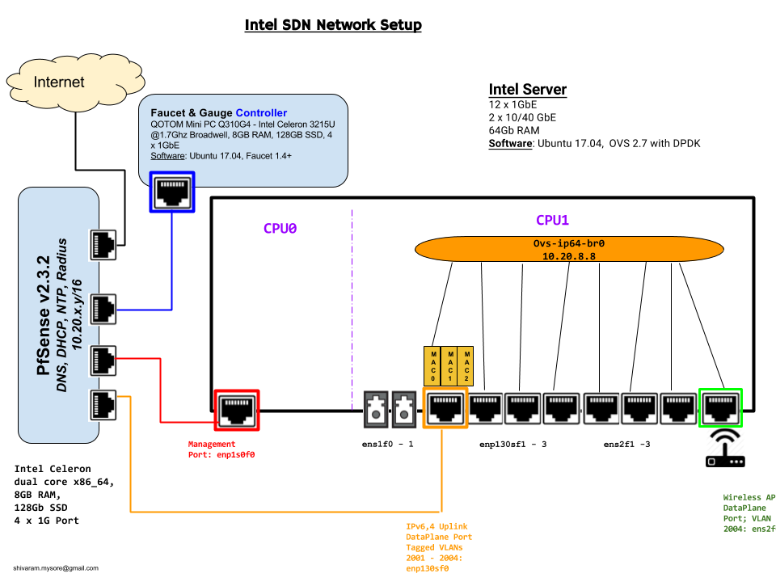

:Authors:
  Shivaram Mysore (shivaram.mysore@gmail.com)

Install OVS with DPDK on Ubunty 17.04 with DPDK Support
=======================================================

Detailed OVS connectivity information
-------------------------------------

**Step0**:
1.  Install `Ubuntu 17.04 Server <https://www.ubuntu.com/download/server>`_ on a x86 box with OpenSSH enabled and one network management interface enabled.
2.  After installation, login to the box and run the command ``ip a`` to get a list of available interfaces and names.
3.  Identify interfaces on your box with the names obtained as a result of the ``ip`` command by running the script `blink_eth_port_led.sh <blink_eth_port_led.sh>`_ with interface name as argument.  The corresponding itnerface name will blink for 5 seconds.  Make a map of network interface names and physical ports.

To setup OVS with DPDK, there are 3 scripts in this directory (run as user root or sudo).  Please review each one and modify it accordingly especially IP addresses, interface names, etc.:

1. `Step1.sh <Step1.sh>`_ - Installs all necessary packages required to get OVS 2.7 working
2. `Step2.sh <Step2.sh>`_ - Sets up the machine to be used with DPDK.  This operation requires a reboot of the machine
3. `Step3.sh <Step3.sh>`_ - Sets up the interfaces to be DPDK enabled and adds them to the created OVS bridge.

Please note that these scripts are not idiot proof.  These scripts can help get a Open vSwitch working on hardware with minimal effort.

Faucet SDN Controller
=====================

`Faucet SDN Controller <http://FaucetSDN.org>`_ can be setup on a different box or on the same box as the one used for OVS. The script `setup_faucet.sh <setup_faucet.sh>`_ can be run to install and configure the same.  Again, please review the script before running the same.

Securing OVS <-> Faucet Openflow Control Channel
================================================

Openflow control channel can be secured via TLS.  `setup_ovs_pki.sh <setup_ovs_pki.sh>`_ provides the necessary steps to accomplish the same.
