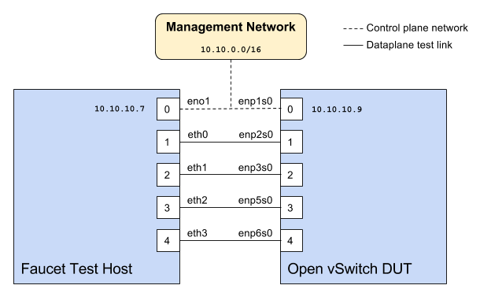

Faucet Testing with OVS on Hardware
===================================

Setup
-----

Faucet configuration file
-------------------------

.. code-block:: yaml
  :caption: /etc/faucet/hw_switch_config.yaml
  :name: ovs/hw_switch_config.yaml

  # Faucet Configuration file: /etc/faucet/hw_switch_config.yaml
  #
  # If hw_switch value set to true, map a hardware OpenFlow switch to ports on this machine.
  # Otherwise, run tests against OVS locally.
  hw_switch: true
  hardware: 'Open vSwitch'
  dp_ports:
    1: eth0
    2: eth1
    3: eth2
    4: eth3

  # Hardware switch's DPID
  dpid: 0xacd28f18b
  cpn_intf: eno1
  of_port: 6636
  gauge_of_port: 6637

Hardware
--------

  #. For Network Interface Cards (NICs), prefer Intel branded models.
  #. I have also used `Hi-Speed USB to dual Ethernet <http://vantecusa.com/products_detail.php?p_id=142&p_name=+USB+3.0+To+Dual+Gigabit+Ethernet+Network+Adapter&pc_id=21&pc_name=Network&pt_id=5&pt_name=Accessories>`_ which works great

Software
--------

  #. Ubuntu 16.04 Xenial
  #. Open vSwitch 2.7.2+

Commands
--------

Commands to be executed on each side - **Faucet Test host** and **Open vSwitch**.

Commands on Faucet Test Host
^^^^^^^^^^^^^^^^^^^^^^^^^^^^

Run these commands as root on the Ubuntu system (v16.04 used)

.. code:: console

  $ sudo mkdir -p /usr/local/src/
  $ sudo mkdir -p /etc/faucet/
  $ sudo cd /usr/local/src/
  $ sudo git clone https://github.com/faucetsdn/faucet.git
  $ cd faucet
  $ sudo ip address show
    1: lo: <LOOPBACK,UP,LOWER_UP> mtu 65536 qdisc noqueue state UNKNOWN group default qlen 1000
    link/loopback 00:00:00:00:00:00 brd 00:00:00:00:00:00
    inet 127.0.0.1/8 scope host lo
    valid_lft forever preferred_lft forever
    inet6 ::1/128 scope host
    valid_lft forever preferred_lft forever
    2: eth0: <BROADCAST,MULTICAST,UP,LOWER_UP> mtu 1500 qdisc mq state UP group default qlen 1000
    link/ether b4:96:91:00:88:a4 brd ff:ff:ff:ff:ff:ff
    inet6 fe80::b696:91ff:fe00:88a4/64 scope link
    valid_lft forever preferred_lft forever
    3: eth1: <BROADCAST,MULTICAST,UP,LOWER_UP> mtu 1500 qdisc mq state UP group default qlen 1000
    link/ether b4:96:91:00:88:a5 brd ff:ff:ff:ff:ff:ff
    inet6 fe80::b696:91ff:fe00:88a5/64 scope link
    valid_lft forever preferred_lft forever
    4: eth2: <BROADCAST,MULTICAST,UP,LOWER_UP> mtu 1500 qdisc mq state UP group default qlen 1000
    link/ether b4:96:91:00:88:a6 brd ff:ff:ff:ff:ff:ff
    inet6 fe80::b696:91ff:fe00:88a6/64 scope link
    valid_lft forever preferred_lft forever
    5: eth3: <BROADCAST,MULTICAST,UP,LOWER_UP> mtu 1500 qdisc mq state UP group default qlen 1000
    link/ether b4:96:91:00:88:a7 brd ff:ff:ff:ff:ff:ff
    inet6 fe80::b696:91ff:fe00:88a7/64 scope link
    valid_lft forever preferred_lft forever
    6: eno1: <BROADCAST,MULTICAST,UP,LOWER_UP> mtu 1500 qdisc mq state UP group default qlen 1000
    link/ether 00:1e:67:ff:f6:80 brd ff:ff:ff:ff:ff:ff
    inet 10.10.10.7/16 brd 10.20.255.255 scope global eno1
    valid_lft forever preferred_lft forever
    inet6 cafe:babe::21e:67ff:feff:f680/64 scope global mngtmpaddr dynamic
    valid_lft 86398sec preferred_lft 14398sec
    inet6 fe80::21e:67ff:feff:f680/64 scope link
    valid_lft forever preferred_lft forever

.. tip::

    To locate the corresponding physical port, you can make the port LED blink with `Ethtool`_.

Commands on Open vSwitch
^^^^^^^^^^^^^^^^^^^^^^^^

Login as ``root`` on the Ubuntu system and install OpenvSwitch and start ``openvswitch-switch`` service

.. code:: console

  $ sudo apt-get install openvswitch-switch
  $ sudo systemctl status openvswitch-switch.service
  $ sudo ovs-vsctl add-br ovs-br0
  $ sudo ovs-vsctl add-port ovs-br0 enp2s0 -- set Interface enp2s0  ofport_request=1
  $ sudo ovs-vsctl add-port ovs-br0 enp3s0 -- set Interface enp3s0  ofport_request=2
  $ sudo ovs-vsctl add-port ovs-br0 enp5s0 -- set Interface enp5s0  ofport_request=3
  $ sudo ovs-vsctl add-port ovs-br0 enp6s0 -- set Interface enp6s0  ofport_request=4
  $ sudo ovs-vsctl set-fail-mode ovs-br0 secure
  $ sudo ovs-vsctl set bridge ovs-br0 protocols=OpenFlow13
  $ sudo ovs-vsctl set-controller ovs-br0 tcp:10.10.10.7:6636 tcp:10.10.10.7:6637
  $ sudo ovs-vsctl get bridge ovs-br0 datapath_id
  $ sudo ovs-vsctl show
    308038ec-495d-412d-9b13-fe95bda4e176
        Bridge "ovs-br0"
            Controller "tcp:10.10.10.7:6636"
            Controller "tcp:10.10.10.7:6637"
            Port "enp3s0"
                Interface "enp3s0"
               Port "enp2s0"
                Interface "enp2s0"
             Port "enp6s0"
                Interface "enp6s0"
            Port "ovs-br0"
                Interface "ovs-br0"
                    type: internal
            Port "enp5s0"
                Interface "enp5s0"
                    type: system
        ovs_version: "2.7.0"

  $ sudo ovs-vsctl -- --columns=name,ofport list Interface
    name                : "ovs-br0"
    ofport              : 65534

    name                : "enp5s0"
    ofport              : 3

    name                : "enp2s0"
    ofport              : 1

    name                : "enp6s0"
    ofport              : 4

    name                : "enp3s0"
    ofport              : 2

.. tip::

    To locate the corresponding physical port, you can make the port LED blink with `Ethtool`_.

Check port speed information to make sure that they are at least 1Gbps

.. code:: console

    $ sudo ovs-ofctl -O OpenFlow13 dump-ports-desc ovs-br0
        OFPST_PORT_DESC reply (OF1.3) (xid=0x2):
         1(enp2s0): addr:00:0e:c4:ce:77:25
             config:     0
             state:      0
             current:    1GB-FD COPPER AUTO_NEG
             advertised: 10MB-HD 10MB-FD 100MB-HD 100MB-FD 1GB-FD COPPER AUTO_NEG AUTO_PAUSE
             supported:  10MB-HD 10MB-FD 100MB-HD 100MB-FD 1GB-FD COPPER AUTO_NEG AUTO_PAUSE
             speed: 1000 Mbps now, 1000 Mbps max
         2(enp3s0): addr:00:0e:c4:ce:77:26
             config:     0
             state:      0
             current:    1GB-FD COPPER AUTO_NEG
             advertised: 10MB-HD 10MB-FD 100MB-HD 100MB-FD 1GB-FD COPPER AUTO_NEG AUTO_PAUSE
             supported:  10MB-HD 10MB-FD 100MB-HD 100MB-FD 1GB-FD COPPER AUTO_NEG AUTO_PAUSE
             speed: 1000 Mbps now, 1000 Mbps max
         3(enp5s0): addr:00:0e:c4:ce:77:27
             config:     0
             state:      0
             current:    1GB-FD COPPER AUTO_NEG
             advertised: 10MB-HD 10MB-FD 100MB-HD 100MB-FD 1GB-FD COPPER AUTO_NEG AUTO_PAUSE
             supported:  10MB-HD 10MB-FD 100MB-HD 100MB-FD 1GB-FD COPPER AUTO_NEG AUTO_PAUSE
             speed: 1000 Mbps now, 1000 Mbps max
         4(enp6s0): addr:00:0a:cd:28:f1:8b
             config:     0
             state:      0
             current:    1GB-FD COPPER AUTO_NEG
             advertised: 10MB-HD COPPER AUTO_NEG AUTO_PAUSE AUTO_PAUSE_ASYM
             supported:  10MB-HD 10MB-FD 100MB-HD 100MB-FD 1GB-HD 1GB-FD COPPER AUTO_NEG
             speed: 1000 Mbps now, 1000 Mbps max
         LOCAL(ovs-br0): addr:00:0a:cd:28:f1:8b
             config:     PORT_DOWN
             state:      LINK_DOWN
             speed: 0 Mbps now, 0 Mbps max

Running the tests
-----------------

Edit the :ref:`ovs/hw_switch_config.yaml` file as shown earlier in this document
setting ``hw_switch=false`` initially for testing.

.. code:: console

    $ sudo cp /usr/local/src/faucet/hw_switch_config.yaml /etc/faucet/hw_switch_config.yaml
    $ sudo $EDITOR /etc/faucet/hw_switch_config.yaml
    $ cd /usr/local/src/faucet/

Install docker by following the :ref:`docker-install` section and then run the hardware based tests by following the :ref:`docker-hw-testing-running` section.

Once the above minitest version is successful with ``hw_switch=false``, then edit the :ref:`ovs/hw_switch_config.yaml` file and set ``hw_switch=true``.

Run tests again, verify they all pass.

Debugging
---------

TCPDump
^^^^^^^

Many times, we want to know what is coming in on a port.  To check on interface ``enp2s0``, for example, use

.. code:: console

  $ sudo tcpdump -A -w enp2s0_all.pcap -i enp2s0

Or

.. code:: console

  $ sudo tcpdump -A -w enp2s0_all.pcap -i enp2s0 'dst host <controller-ip-address> and port 6653'

To read the pcap file, use

.. code:: console

  $ sudo tcpdump -r enp2s0_all.pcap

More detailed examples are available @ https://www.wains.be/pub/networking/tcpdump_advanced_filters.txt

.. note::
    On which machine should one run tcpdump?

    Depends, if you want to examine the packet_ins tht are sent from switch to controller, run on the switch listening on the interface that is talking to the controller.  If you are interested on what is coming in on a particular test port, then run it on the Test Host on that interface.

Ethtool
^^^^^^^
To locate a physical port say ``enp2s0``, make the LED blink for 5 seconds:

.. code:: console

  $ sudo ethtool -p enp2s0 5

To figure out speed on the interface.  Note that if Speed on the interface is at least not 1G, then tests may not run correctly.

.. code:: console

  $ sudo ethtool enp2s0
  $ sudo ethtool enp2s0 | grep Speed

References
^^^^^^^^^^

https://www.garron.me/en/linux/ubuntu-network-speed-duplex-lan.html
