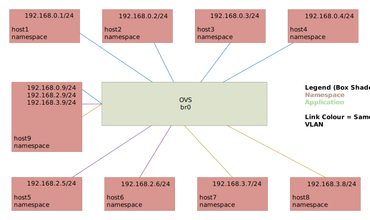

VLAN Tutorial
=============

Next we are going to introduce VLANs.

ETA: ~30 mins.

Prerequisites:
^^^^^^^^^^^^^^

- Faucet - `Package installation steps 1 & 2 <https://faucet.readthedocs.io/en/latest/tutorials.html#package-installation>`__
- OpenVSwitch - `Connect your first datapath steps 1 & 2 <https://faucet.readthedocs.io/en/latest/tutorials.html#connect-your-first-datapath>`__
- Useful Bash Functions - Copy and paste the following definitions into your bash terminal, or to make them persistent between sessions add them to the bottom of your .bashrc and run 'source .bashrc'.

.. literalinclude:: _static/tutorial/create_ns

.. literalinclude:: _static/tutorial/as_ns

.. literalinclude:: _static/tutorial/cleanup

- to add a tagged network interface to a host namespaces

.. literalinclude:: _static/tutorial/add_tagged_dev_ns
    :language: bash

Overview:
^^^^^^^^^

In this tutorial we will look at how to do the following tasks using Faucet:

- Use VLANs to segment traffic.
- Create Trunk links.
- ACLs for a particular VLAN.

.. note:: You can find routing between VLANs `here <./routing.html#routing-between-vlans>`_

A port can be in several VLAN modes:
1. native - where packets come into the switch with no 802.1Q tag.
2. tagged - where packets come into the switch with a 802.1Q tag.
3. Both native and tagged.

If a packet comes in with a tag for a VLAN that the port is not configured for it will be dropped.

Configuring VLANs:
^^^^^^^^^^^^^^^^^^

To demonstrate these tasks we will use a demo network where a single switch br0 connects to 9 hosts.

Ports 1, 2, 5, 6 will be native (untagged) ports.
While ports 3 & 4, 7 & 8, and 9 will be tagged ports.

Here is the structure of the demo setup.

.. note:: Keep a piece of paper with the network layout and hosts' names, VLANs, IPs to simplify following the rest of the tutorial.

Network setup
-------------

Let’s start. Keep host1, host2 on the native vlan 100 (office vlan) as in the first and second tutorials.

.. note:: To create the hosts and switch again run

    .. code:: console

        cleanup
        create_ns host1 192.168.0.1/24
        create_ns host2 192.168.0.2/24
        sudo ovs-vsctl add-br br0 \
        -- set bridge br0 other-config:datapath-id=0000000000000001 \
        -- set bridge br0 other-config:disable-in-band=true \
        -- set bridge br0 fail_mode=secure \
        -- add-port br0 veth-host1 -- set interface veth-host1 ofport_request=1 \
        -- add-port br0 veth-host2 -- set interface veth-host2 ofport_request=2 \
        -- set-controller br0 tcp:127.0.0.1:6653 tcp:127.0.0.1:6654

Then add the following hosts with the corresponding vlan:

- Assign host3 and host4 a vlan interface (vid:100) as they are on a tagged port.
- Assign host5 and host6 an IP address from the VLAN 200 range.
- Assign host7 and host8 a vlan interface (vid:300) as they are on a tagged port.
- Add host9 to all vlans (100, 200, 300) to work as a NFV host.

Tagged vlan 100

.. code:: console

    create_ns  host3 0
    create_ns  host4 0
    add_tagged_dev_ns host3 192.168.0.3/24 100
    add_tagged_dev_ns host4 192.168.0.4/24 100

Native vlan 200

.. code:: console

    create_ns  host5 192.168.2.5/24
    create_ns  host6 192.168.2.6/24

Tagged vlan 300

.. code:: console

    create_ns  host7 0
    create_ns  host8 0
    add_tagged_dev_ns host7 192.168.3.7/24 300
    add_tagged_dev_ns  host8 192.168.3.8/24 300

Trunk link for host9

.. code:: console

    create_ns  host9 0
    add_tagged_dev_ns host9 192.168.0.9/24 100
    add_tagged_dev_ns host9 192.168.2.9/24 200
    add_tagged_dev_ns host9 192.168.3.9/24 300

Then  connect all the hosts to the switch (br0)

.. code:: console

    sudo ovs-vsctl add-port br0 veth-host3 -- set interface veth-host3 ofport_request=3 \
    -- add-port br0 veth-host4 -- set interface veth-host4 ofport_request=4 \
    -- add-port br0 veth-host5 -- set interface veth-host5 ofport_request=5 \
    -- add-port br0 veth-host6 -- set interface veth-host6 ofport_request=6 \
    -- add-port br0 veth-host7 -- set interface veth-host7 ofport_request=7 \
    -- add-port br0 veth-host8 -- set interface veth-host8 ofport_request=8 \
    -- add-port br0 veth-host9 -- set interface veth-host9 ofport_request=9

Now we have everything to start working with faucet through its configuration file.
Each time we will only need to change the configuration file and restart faucet (or send it HUP signal to reload the configuration file).

Basic vlan settings
-------------------

Change /etc/faucet/faucet.yaml to reflect our setting.

.. code-block:: yaml
    :caption: /etc/faucet/faucet.yaml

    vlans:
        vlan100:
            vid: 100
        vlan200:
            vid: 200
        vlan300:
            vid: 300
    dps:
        sw1:
            dp_id: 0x1
            hardware: "Open vSwitch"
            interfaces:
                1:
                    name: "host1"
                    description: "host2 network namespace"
                    native_vlan: vlan100
                2:
                    name: "host2"
                    description: "host2 network namespace"
                    native_vlan: vlan100
                3:
                    name: "host3"
                    tagged_vlans: [vlan100]
                4:
                    name: "host4"
                    tagged_vlans: [vlan100]
                5:
                    name: "host5"
                    native_vlan: vlan200
                6:
                    name: "host6"
                    native_vlan: vlan200
                7:
                    name: "host7"
                    tagged_vlans: [vlan300]
                8:
                    name: "host8"
                    tagged_vlans: [vlan300]
                9:
                    name: "host9"
                    tagged_vlans: [vlan100,vlan200,vlan300]

Send SIGHUP signal to reload the configuration file, and check how its log the new configuration in /var/log/faucet/faucet.log

.. code:: console

    sudo systemctl reload faucet
    cat /var/log/faucet/faucet.log

Let's do the following simple tests:

1. Ping between hosts in the same vlan

.. code:: console

    as_ns host1 ping 192.168.0.2
    as_ns host3 ping 192.168.0.4
    as_ns host5 ping 192.168.2.6
    as_ns host7 ping 192.168.3.8

All should work.

2. Ping between hosts in the same vlan where the port's vlan mode is both native and tagged. In particular between host1 (native vlan100) to host3 (tagged vlan100).

.. code:: console

    as_ns host1 ping 192.168.0.3

3. Ping between hosts in different vlans. Let's change host5 (native vlan200) ip to be 192.168.0.5 and try to ping it from host1 (native vlan100).

.. code:: console

    as_ns host5 ifconfig veth0 192.168.0.5
    as_ns host1 ping 192.168.0.5

It will not ping as they are in different vlans.
Let's set host5's IP back.

.. code:: console

    as_ns host5 ifconfig veth0 192.168.2.5

4. Test the trunk link to host9 from different vlans

.. code:: console

    as_ns host1 ping 192.168.0.9
    as_ns host3 ping 192.168.0.9
    as_ns host5 ping 192.168.2.9
    as_ns host7 ping 192.168.3.9

All of this traffic should go through to host9 as it is connected through the trunk link.

Vlan ACL
--------

Let's apply an ACL on a particular vlan (e.g. vlan300). We will block any ICMP packets on vlan300.
First create an ACL to block the ping.
Open /etc/faucet/faucet.yaml and add the 'acls' section.

.. code-block:: yaml
    :caption: /etc/faucet/faucet.yaml

    acls:
        block-ping:
            - rule:
                dl_type: 0x800      # IPv4
                ip_proto: 1         # ICMP
                actions:
                    allow: False
            - rule:
                dl_type: 0x86dd     # IPv6
                ip_proto: 58        # ICMPv6
                actions:
                    allow: False

Then apply this ACL on vlan300.

.. code-block:: yaml
    :caption: /etc/faucet/faucet.yaml

    vlans:
        vlan100:
            vid: 100
            faucet_vips: ["192.168.0.254/24"]
        vlan200:
            vid: 200
            faucet_vips: ["192.168.2.254/24"]
        vlan300:
            vid: 300
            acls_in: [block-ping] # Acl apply only on vlan300

Just before we reload the configuration file. Let's verify that pinging is working between hosts in vlan300.

.. code:: console

    as_ns host7 ping 192.168.3.8

Now let's apply the configuration, send SIGHUP signal to reload the configuration file.

.. code:: console

    sudo systemctl reload faucet

Now if you try to ping from host7 and host8, it will not work as it is specified by their vlan acl.

.. code:: console

    as_ns host7 ping 192.168.3.8
