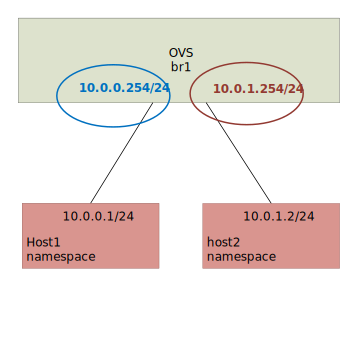
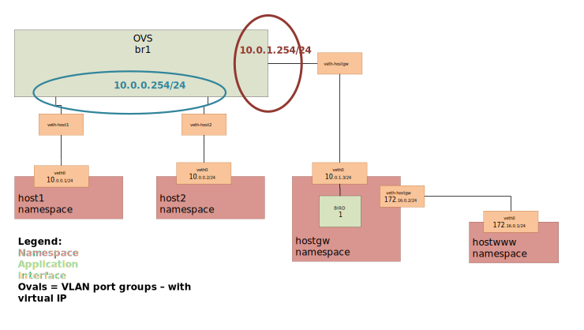
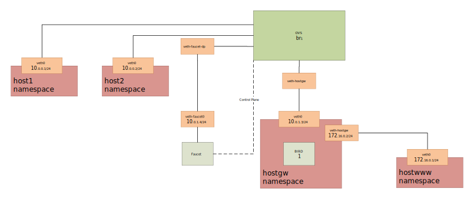

Routing Tutorial
================

This tutorial will cover routing with Faucet.

There are three types of routing we can use.

- Inter VLAN routing
- Static routing
- BGP via an external application (Quagga, Bird, EXABGP, ...)

Prerequisites:
^^^^^^^^^^^^^^

- Faucet - `Package installation steps 1 & 2 <https://faucet.readthedocs.io/en/latest/tutorials.html#package-installation>`__
- OpenVSwitch - `Connect your first datapath steps 1 & 2 <https://faucet.readthedocs.io/en/latest/tutorials.html#connect-your-first-datapath>`__
- Useful Bash Functions (`create_ns <_static/tutorial/create_ns>`_, `as_ns <_static/tutorial/as_ns>`_, `cleanup <_static/tutorial/cleanup>`_). To make these functions persistent between sessions add them to the bottom of your .bashrc and run 'source .bashrc'

Run the cleanup script to remove old namespaces and switches:

.. code:: console

    cleanup

Routing between VLANs
^^^^^^^^^^^^^^^^^^^^^
Let's start with a single switch connected to two hosts in two different vlans.

.. code:: console

    create_ns host1 10.0.0.1/24
    create_ns host2 10.0.1.2/24
    sudo ovs-vsctl add-br br1 \
    -- set bridge br1 other-config:datapath-id=0000000000000001 \
    -- set bridge br1 other-config:disable-in-band=true \
    -- set bridge br1 fail_mode=secure \
    -- add-port br1 veth-host1 -- set interface veth-host1 ofport_request=2 \
    -- add-port br1 veth-host2 -- set interface veth-host2 ofport_request=3 \
    -- set-controller br1 tcp:127.0.0.1:6653 tcp:127.0.0.1:6654

To allow traffic between vlans we use a router, and assign each VLAN at least one IP address (gateway IP address).
Lets add the routers and vlans section like so.

.. code-block:: yaml
    :caption: /etc/faucet/faucet.yaml
    :name: intervlan-routing-yaml

    vlans:
        vlan100:
            vid: 100
            faucet_vips: ["10.0.0.254/24"]  # Faucet's virtual IP address for vlan100
        vlan200:
            vid: 200
            faucet_vips: ["10.0.1.254/24"]  # Faucet's virtual IP address for vlan200

    routers:
        router-1:                           # Router name
            vlans: [vlan100, vlan200]       # names of vlans to allow routing between.

    dps:
        sw1:
            dp_id: 0x1
            hardware: "Open vSwitch"
            interfaces:
                1:
                    name: "host1"
                    description: "host1 network namespace"
                    native_vlan: vlan100
                2:
                    name: "host2"
                    description: "host2 network namespace"
                    native_vlan: vlan200

Send the SIGHUP signal to reload the configuration file.

.. code:: console

    sudo pkill -HUP -f "faucet\.faucet"

Add the default route to the 'faucet_vips' as above.

.. code:: console

    as_ns host1 ip route add default via 10.0.0.254 dev veth0
    as_ns host2 ip route add default via 10.0.1.254 dev veth0

Then generate some traffic between our two hosts.

.. code:: console

    as_ns host1 ping 10.0.1.2

It should work and traffic should go through.

Static Routing
^^^^^^^^^^^^^^

For this we will set-up a Faucet switch with three hosts.
One of these hosts will act like a gateway,

.. image:: _static/images/static-routing.svg
    :alt: static routing network diagram

Run the cleanup script to remove old namespaces and switches.

.. code:: console

    cleanup

Create 3 hosts, in 2 different subnets:

.. code:: console

    create_ns host1 10.0.0.1/24
    create_ns host2 10.0.0.2/24
    create_ns hostgw 10.0.1.3/24

And add a default route for each host to it's gateway router.

.. code:: console

    as_ns host1 ip route add default via 10.0.0.254
    as_ns host2 ip route add default via 10.0.0.254
    as_ns hostgw ip route add default via 10.0.1.254

Create the bridge and add hosts 1, 2 and the gw to br1.

.. code:: console

    sudo ovs-vsctl add-br br1 \
    -- set bridge br1 other-config:datapath-id=0000000000000001 \
    -- set bridge br1 other-config:disable-in-band=true \
    -- set bridge br1 fail_mode=secure \
    -- add-port br1 veth-host1 -- set interface veth-host1 ofport_request=1 \
    -- add-port br1 veth-host2 -- set interface veth-host2 ofport_request=2 \
    -- add-port br1 veth-hostgw -- set interface veth-hostgw ofport_request=3 \
    -- set-controller br1 tcp:127.0.0.1:6653 tcp:127.0.0.1:6654

For this Faucet configuration we will start from scratch.
First we need to define 2 VLANs.

1. Hosts.
2. Gateway.

Here we have 3 new options:

- faucet_mac: The MAC address of Faucet's routing interface on this VLAN. If we do not set faucet_mac for each VLAN, routed packets will be dropped unless 'drop_spoofed_faucet_mac' is set to false. TODO explain above more.
- faucet_vips: The IP address for Faucet's routing interface on this VLAN. Multiple IP addresses (IPv4 & IPv6) can be used.
- routes: Static routes for this VLAN.

.. code-block:: yaml
    :caption: /etc/faucet/faucet.yaml

    vlans:
        br1-hosts:
            vid: 100
            description: "h1 & h2's vlan"
            faucet_mac: "00:00:00:00:00:11"
            faucet_vips: ["10.0.0.254/24"]

        br1-gw:
            vid: 200
            description: "vlan for gw port"
            faucet_mac: "00:00:00:00:00:22"
            faucet_vips: ["10.0.1.254/24"]
            routes:
                - route:
                    ip_dst: "0.0.0.0/24"
                    ip_gw: '10.0.1.3'

As our routing interface is in a different VLAN, we will want to route between the two VLANs on the switch (br1-hosts & br1-peer).
So as with inter VLAN routing we will create a router for each switch.

.. code-block:: yaml
    :caption: /etc/faucet/faucet.yaml

    routers:
        router-br1:
            vlans: [br1-hosts, br1-gw]

And the rest of the configuration looks like this:

.. code-block:: yaml
    :caption: /etc/faucet/faucet.yaml

    dps:
        br1:
            dp_id: 0x1
            hardware: "Open vSwitch"
            interfaces:
                1:
                    name: "host1"
                    description: "host1 network namespace"
                    native_vlan: br1-hosts
                2:
                    name: "host2"
                    description: "host2 network namespace"
                    native_vlan: br1-hosts
                3:
                    name: "gw:"
                    description: "hostgw network namespace"
                    native_vlan: br1-gw

Start/reload Faucet.

.. code:: console

    sudo systemctl restart faucet

And we should now be able to ping (the first few packets may get lost as ?arp? Does it's thing).

.. code:: console

    as_ns host1 ping 10.0.1.3
    PING 10.0.1.3 (10.0.1.3) 56(84) bytes of data.
    64 bytes from 10.0.1.3: icmp_seq=2 ttl=62 time=0.625 ms
    64 bytes from 10.0.1.3: icmp_seq=3 ttl=62 time=0.133 ms
    64 bytes from 10.0.1.3: icmp_seq=4 ttl=62 time=0.064 ms
    64 bytes from 10.0.1.3: icmp_seq=5 ttl=62 time=0.090 ms

BGP Routing
^^^^^^^^^^^

For this section we are going to change our static routes from above into BGP routes.

BGP (and other routing) is provided by a NFV service, here we will use `BIRD <http://bird.network.cz/>`_.
Other applications such as ExaBGP & Quagga could be used.
Faucet imports all routes provided by this NVF service.
This means we can use our service for other routing protocols (OSPF, RIP, etc) and apply filtering using the service's policy language.
See `Routing 2 Tutorial <routing-2.html>`_ for more advanced BGP route filtering.

If you are NOT using the workshop VM you will need to install BIRD.

Setup
-----

To install BIRD:

.. code:: console

    sudo apt-get install bird

Our data plane will end up looking like this:

.. note:: When using BGP and Faucet, if changing Faucet's routing configuration (routers, static routes, or a VLAN's BGP configuration) the Faucet application must be restarted to reload the configuration correctly (not sighup reloaded).

Remove the static routes added above:

.. code-block:: yaml
    :caption: /etc/faucet/faucet.yaml

    vlans:
        br1-hosts:
            vid: 100
            description: "h1 & h2's vlan"
            faucet_mac: "00:00:00:00:00:11"
            faucet_vips: ["10.0.0.254/24"]

        br1-gw:
            vid: 200
            description: "vlan for peering port"
            faucet_mac: "00:00:00:00:00:22"
            faucet_vips: ["10.0.1.254/24"]

    routers:
        router-br1:
            vlans: [br1-hosts, br1-gw]

    dps:
        br1:
            dp_id: 0x1
            hardware: "Open vSwitch"
            interfaces:
                1:
                    name: "host1"
                    description: "host1 network namespace"
                    native_vlan: br1-hosts
                2:
                    name: "host2"
                    description: "host2 network namespace"
                    native_vlan: br1-hosts
                3:
                    name: "gw"
                    description: "hostgw network namespace"
                    native_vlan: br1-gw

Reload Faucet

.. code:: console

    sudo pkill -HUP -f "faucet\.faucet"

And check that host1 can ping host2 but not the gw.

.. code:: console

    as_ns host1 ping 10.0.0.2
    as_ns host1 ping 10.0.1.3

Next we will add Faucet to our switch's data plane so that it can communicate with the BGP speaking hostgw.

.. code:: console

    sudo ip link add veth-faucet0 type veth peer name veth-faucet-dp
    sudo ovs-vsctl add-port br1 veth-faucet-dp -- set interface veth-faucet-dp ofport_request=4
    sudo ip addr add 10.0.1.4/24 dev veth-faucet0
    sudo ip link set veth-faucet0 up
    sudo ip link set veth-faucet-dp up

We will also add another host connected to hostgw to act as the Internet and give it the IP address 1.0.0.1.

.. code:: console

    create_ns hostwww 172.16.0.1/24
    as_ns hostwww ip route add default via 172.16.0.2
    as_ns hostwww ip addr add 1.0.0.1/24 dev veth0
    sudo ip link set veth-hostwww netns hostgw
    as_ns hostgw ip addr add 172.16.0.2/24 dev veth-hostwww
    as_ns hostgw ip link set veth-hostwww up
    as_ns hostgw ip route replace default via 172.16.0.1
    as_ns hostgw ip route add 10.0.0.0/24 via 10.0.1.254

To configure BIRD

.. code-block:: cfg
    :caption: /etc/bird/bird.conf

    protocol kernel {
        scan time 60;
        import none;
    }

    protocol device {
        scan time 60;
    }

    # Local
    # TODO is this right?
    protocol static {
        route 172.16.0.0/24 via 172.16.0.2
        route 1.0.0.0/24 via 172.16.0.2
    }

    # Faucet bgp peer config.
    # Will import all routes available, including the static ones above.
    protocol bgp faucet {
        local as 64513;
        neighbor 10.0.1.4 port 9179 as 64512;
        export all;
        import all;
        next hop self;
    }

Create the directory for Bird's server control socket and start BIRD:

.. code:: console

    sudo mkdir /run/bird
    as_ns hostgw bird

We'll configure Faucet by adding the BGP configuration to the br1-gw VLAN.

.. code-block:: yaml
    :caption: /etc/faucet/faucet.yaml

    vlans:
        br1-hosts:
            vid: 100
            description: "h1 & h2's vlan"
            faucet_mac: "00:00:00:00:00:11"
            faucet_vips: ["10.0.0.254/24"]

        br1-gw:
            vid: 200
            description: "vlan for peering port"
            faucet_mac: "00:00:00:00:00:22"
            faucet_vips: ["10.0.1.254/24"]
            bgp_port: 9179                          # BGP port for Faucet to listen on.
            bgp_as: 64512                           # Faucet's AS number
            bgp_routerid: '10.0.1.4'                # Faucet's Unique ID.
            bgp_neighbor_addresses: ['10.0.1.3']    # Neighbouring IP addresses (IPv4/IPv6)
            bgp_connect_mode: active                #
            bgp_neighbor_as: 64513                  # Neighbour's AS number

    routers:
        br1-router:
            vlans: [br1-hosts, br1-gw]

And finally add the port configuration for the Faucet data plane interface (veth-faucet0).

.. code-block:: yaml
    :caption: /etc/faucet/facuet.yaml

    dps:
        br1:
            ...
            interfaces:
                ...
                4:
                    name: "faucet-dataplane"
                    description: "faucet's dataplane connection for bgp"
                    native_vlan: br1-gw

Now restart Faucet.

.. code:: console

    sudo systemctl restart faucet

and our logs should show us 'BGP peer router ID 10.0.1.3 AS 64513 up' & 'BGP add 172.16.0.0/24 nexthop 10.0.1.3' which is our route advertised via BGP.

.. code-block:: console
    :caption: /var/log/faucet/faucet.log

    May 10 13:42:54 faucet INFO     Reloading configuration
    May 10 13:42:54 faucet INFO     configuration /etc/faucet/faucet.yaml changed, analyzing differences
    May 10 13:42:54 faucet INFO     Add new datapath DPID 1 (0x1)
    May 10 13:42:55 faucet INFO     BGP peer router ID 10.0.1.3 AS 64513 up
    May 10 13:42:55 faucet INFO     BGP add 172.16.0.0/24 nexthop 10.0.1.3
    May 10 13:42:55 faucet.valve INFO     DPID 1 (0x1) Cold start configuring DP
    May 10 13:42:55 faucet.valve INFO     DPID 1 (0x1) Configuring VLAN br1-gw vid:200 ports:Port 3,Port 4
    May 10 13:42:55 faucet.valve INFO     DPID 1 (0x1) Configuring VLAN br1-hosts vid:100 ports:Port 1,Port 2
    May 10 13:42:55 faucet.valve INFO     DPID 1 (0x1) Port 1 configured
    May 10 13:42:55 faucet.valve INFO     DPID 1 (0x1) Port 2 configured
    May 10 13:42:55 faucet.valve INFO     DPID 1 (0x1) Port 3 configured
    May 10 13:42:55 faucet.valve INFO     DPID 1 (0x1) Port 4 configured
    May 10 13:42:55 faucet.valve INFO     DPID 1 (0x1) Ignoring port:4294967294 not present in configuration file
    May 10 13:42:56 faucet.valve INFO     DPID 1 (0x1) resolving 10.0.1.3 (2 flows) on VLAN 200

Now we should be able to ping from host1 to hostwww.

.. code:: console

    as_ns host1 ping 172.16.0.1
    PING 172.16.0.1 (172.16.0.1) 56(84) bytes of data.
    64 bytes from 172.16.0.1: icmp_seq=2 ttl=62 time=0.165 ms
    64 bytes from 172.16.0.1: icmp_seq=3 ttl=62 time=0.058 ms
    64 bytes from 172.16.0.1: icmp_seq=4 ttl=62 time=0.057 ms

.. code:: console

    as_ns host1 ping 1.0.0.1
    PING 1.0.0.1 (1.0.0.1) 56(84) bytes of data.
    64 bytes from 1.0.0.1: icmp_seq=1 ttl=62 time=0.199 ms
    64 bytes from 1.0.0.1: icmp_seq=2 ttl=62 time=0.053 ms
    64 bytes from 1.0.0.1: icmp_seq=3 ttl=62 time=0.058 ms
    64 bytes from 1.0.0.1: icmp_seq=4 ttl=62 time=0.054 ms

For more advanced routing including BGP route policy filtering see `routing 2 tutorial <routing-2.html>`_.
