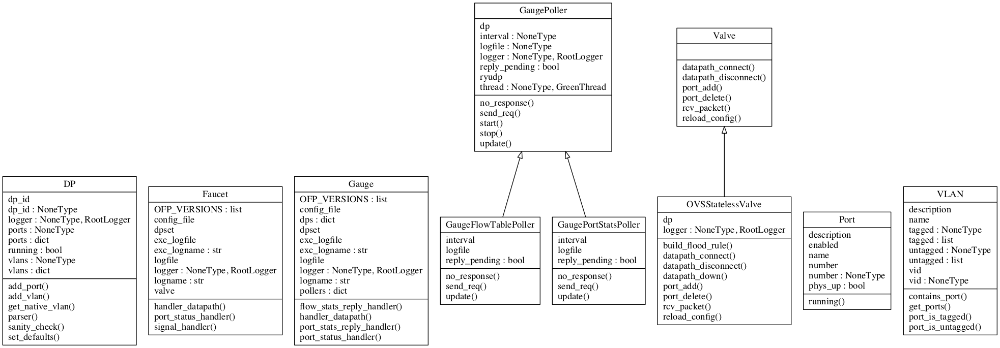
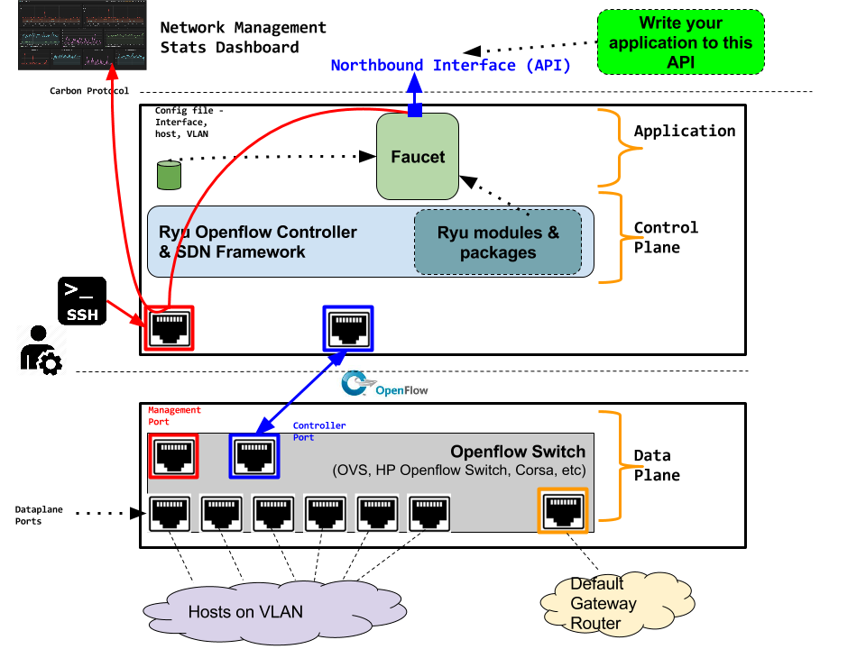

:copyright: 2015 `REANNZ <http://www.reannz.co.nz/>`_.  All Rights Reserved.

.. meta::
   :keywords: Openflow, Ryu, Faucet, VLAN, SDN

==============================
Faucet Design and Architecture
==============================

Faucet enables providing L2 Switches for the masses not classes 

---------------------------------
Terminology used in this document
---------------------------------

Switch and Dataplane or Data Plane are used interchangeably 

-----------------
Design Principles
-----------------

1.  Migration Use Case: The system as a whole MUST be able to do a 1:1 replacement for an existing enterprise L2 switch with a whitebox (ex. x86 based 1U server with lots of ethernet ports).  Additionally, Ryu controller with Faucet is run on a different machine (VM or physical hardware with at least 2 ethernet ports) from the replacement switch.
2.  Switch requirements - OpenFlow (OF) v1.3 support. OF-Config support is not required.
3.  OF v1.3 requirements - Both IPv4 & IPv6 support, push/pop/swap VLAN Tags, Multi-table support (ability to support multiple actions and better use of limited TCAM support), Group Table support is nice to have - if available, optimizations can be deployed. 
4.  No SNMP is required or used as it is reactive for NMS system.
5.  Uses Carbon (JSON) to communicate to Network Management System (NMS).  Currently One specified controller is allowed to interact with the switch for telemetry data and switch responds the last 30 seconds of data so that data plane processing performance is consistent.

    1.  Hardware data planes needs to push telemetry data to only one end point (unsolicited) and every other client will talk to that one end point.
6.  Controller:

    1.  Support for multiple controllers for HA (Roadmap)
    2.  Controllers to control multiple switches (Roadmap)
    3.  Faucet does not use Master/Slave/Equal Controller roles (Roadmap) 
    4.  Option for Data Plane port to dedicated Controller - Controller channel - slow path
    5.  Option for Data Plane port to dedicated Controller - pure open flow - fast path  - offload processing

----------------------------------------
Configuring OVS to stream telemetry data
----------------------------------------

How-To instructions go here

-------------
Faucet on Ryu
-------------

Ryu provides
------------
 
1.  Library to serialize and unserialize OpenFlow messages
2.  Event handling framework - port changes call me, switch changes call me, etc
3.  Python - programming language favorable to DevOps folks is used.
4.  Faucet is an application for Ryu controller

Faucet Application
------------------

*  Reads one simple config file (YAML file) that provides switch information such as ports and hosts connected to specific ports.
*  Config file can be used to hardcode a network configuration that can specify what hosts are connected to what ports.  Alternatively, the system can dynamically do MAC learning and discover hosts.
*  Both tagged and untagged VLAN is supported
*  Ability to push statistics via Carbon to a NMS system
*  Currently supports 1 controller/1switch
*  MAC learning supported
*  ACL support (Roadmap): Cisco ACL functionality such as permit/deny access list on a port; firewall style rules on a per port basis

============
UML Diagrams
============

=======================
Deployment Architecture
=======================

-------------
Roadmap Items
-------------

*  Cisco style ACL support
*  HA support
*  Support for using OF Controller Roles
*  Support for Controller only port/channel
*  Support for Controller port/channel wherein only OF messages are exchanged without Ethernet headers and use of naked OF messages to enable fast-path processing.
*  DHCP Server with Faucet:
   1. Possibly done either in user space in Ryu itself (ie. Python code that runs it) or (for example) using VANDERVECKEN/RouteFlow style VMs (the controller tells the switch to intercept certain packets - like it already does for ARP - and give them to a helper application that runs inside  VM/namespace). RouteFlow already does this for Quagga.
   2. Integrate with enterprise infrastructure's DHCP server
   3. Integrating DHCP with Faucet means that it can prevent address conflicts. For example, the switch can enforce policy
   4. Faucet specific: Possibly add additional config options in the YAML file (so there is no need for an operator who doesn't care about the implementation to know).

